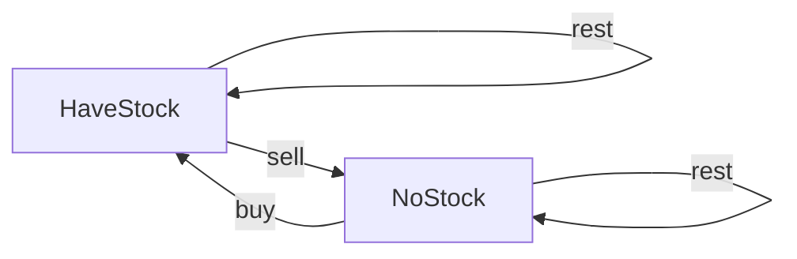

# Algorithm Framework

## Trick

:fire: **LRU_cache可作用于递归函数，取代memo**

## Data Structure

### Linked List

```python
'''
基本的单链表节点
'''
class Node:
		def __init__(self, val):
      self.val = val
      self.next = None
      
    def traverse(self):
      # node.val
      while node:
        node = node.next
        
    def traverse(self):
      # nodel.val
      self.traverse(node.next)
```

### Binary Tree

```python
'''
基本的二叉树节点
'''
class TreeNode:
  def __init__(self, val):
    self.val = val
    self.left = None
    self.right = None

	def traverse(self):
    # 前序遍历
    self.traverse(self.left)
    # 中序遍历
    self.traverse(self.right)
    # 后序遍历
    
'''
N叉树
'''
class NTreeNode:
  def __init__(self, val):
    self.val = val
    self.children = []

	def traverse(self):
    for child in children:
      self.traverse(child)
```

**写树相关的算法，简单说就是，先搞清楚当前`root`节点该做什么，然后根据函数定义递归调用子节点**，递归调用会让孩子节点做相同的事情。

:fire:**递归算法的关键要明确函数的定义，相信这个定义，而不要跳进递归细节。**

[116. 填充二叉树节点的右侧指针](https://leetcode-cn.com/problems/populating-next-right-pointers-in-each-node/)

**二叉树的问题难点在于，如何把题目的要求细化成每个节点需要做的事情**，但是如果只依赖一个节点的话，肯定是没办法连接「跨父节点」的两个相邻节点的。那么，我们的做法就是增加函数参数，一个节点做不到，我们就给他安排两个节点，「将每一层二叉树节点连接起来」可以细化成「将每两个相邻节点都连接起来」：

```python
class Solution:
    def connect_two_node(self, node1, node2):
      	'''
      	增加参数来帮助递归
      	'''
        if not node1 or not node2:
            return
        node1.next = node2
        # 状态1：节点1的左右连接
        self.connect_two_node(node1.left, node1.right)
        # 状态2：节点2的左右连接
        self.connect_two_node(node2.left, node2.right)
        # 状态3：节点1的右与节点2左连接
        self.connect_two_node(node1.right, node2.left)

    def connect(self, root: 'Node') -> 'Node':
        if not root:
            return
        self.connect_two_node(root.left, root.right)
        return root
```

[114. 二叉树展开链表](https://leetcode-cn.com/problems/flatten-binary-tree-to-linked-list/)

```python
def flatten(self, root: TreeNode) -> None:
    """
    Do not return anything, modify root in-place instead.
    """
    if not root:
        return

    self.flatten(root.left)
    self.flatten(root.right)

    l = root.left
    r = root.right

    root.left = None
    root.right = l

    p = root
    while p.right:
        p = p.right
    p.right = r
    return root
```

你看，这就是递归的魅力，你说`flatten`函数是怎么把左右子树拉平的？不容易说清楚，**但是只要知道`flatten`的定义如此，相信这个定义，让`root`做它该做的事情，然后`flatten`函数就会按照定义工作。**

另外注意递归框架是后序遍历，因为我们要先拉平左右子树才能进行后续操作。

## Dynamic Programming

**首先，动态规划问题的一般形式就是求最值**。动态规划其实是运筹学的一种最优化方法，只不过在计算机问题上应用比较多，比如说让你求**最长**递增子序列呀，**最小**编辑距离呀等等。

既然是要求最值，核心问题是什么呢？**求解动态规划的核心问题是穷举**。因为要求最值，肯定要把所有可行的答案穷举出来，然后在其中找最值呗。

- 首先，动态规划的穷举有点特别，因为这类问题**存在「重叠子问题」**，如果暴力穷举的话效率会极其低下，所以需要「备忘录」或者「DP table」来优化穷举过程，避免不必要的计算。

- 而且，动态规划问题一定会**具备「最优子结构」**，才能通过子问题的最值得到原问题的最值。

- 另外，虽然动态规划的核心思想就是穷举求最值，但是问题可以千变万化，穷举所有可行解其实并不是一件容易的事，只有列出**正确的「状态转移方程」**才能正确地穷举。

以上提到的**重叠子问题、最优子结构、状态转移方程**就是动态规划三要素。具体什么意思等会会举例详解，但是在实际的算法问题中，**写出状态转移方程是最困难的**，这也就是为什么很多朋友觉得动态规划问题困难的原因，我来提供我研究出来的一个思维框架，辅助你思考状态转移方程：

**明确 base case -> 明确「状态」-> 明确「选择」 -> 定义 dp 数组/函数的含义**。

**方法：**

- **暴力递归**
- **带memory的递归（自顶向下）**
- **dp数组迭代解法（自底向上）**

---

### Stock Problem

[买卖股票的最佳时机](https://leetcode-cn.com/problems/best-time-to-buy-and-sell-stock/solution/) :ballot_box_with_check:

[买卖股票的最佳时机 II](https://leetcode-cn.com/problems/best-time-to-buy-and-sell-stock-ii/) :ballot_box_with_check:

[买卖股票的最佳时机 III :ballot_box_with_check:](https://leetcode-cn.com/problems/best-time-to-buy-and-sell-stock-iii/)

[买卖股票的最佳时机 IV :ballot_box_with_check:](https://leetcode-cn.com/problems/best-time-to-buy-and-sell-stock-iv/)

[最佳买卖股票时机含冷冻期 :ballot_box_with_check:](https://leetcode-cn.com/problems/best-time-to-buy-and-sell-stock-with-cooldown/)

[买卖股票的最佳时机含手续费 :ballot_box_with_check:](https://leetcode-cn.com/problems/best-time-to-buy-and-sell-stock-with-transaction-fee/)




```python
'''
dp[i][k][0 or 1]
0 <= i <= n-1, 1 <= k <= K
n 为天数，大 K 为最多交易数
此问题共 n × K × 2 种状态，全部穷举就能搞定。
'''
# base case
for k in range(k+1):
  dp[0][k][0] = 0
  dp[0][k][1] = -prices[0]
# iteration
for 0 <= i < n:
    for 1 <= k <= K:
        for s in {0, 1}:
            dp[i][k][s] = max(buy, sell, rest)
return max(dp[-1][k][0])
```

### EGG Problem

[887.鸡蛋掉落](https://leetcode-cn.com/problems/super-egg-drop/)

#### 二分搜索 + 递归 + 剪枝

我们在第`i`层楼扔了鸡蛋之后，可能出现两种情况：鸡蛋碎了，鸡蛋没碎。**注意，这时候状态转移就来了**：

- **如果鸡蛋碎了**，那么鸡蛋的个数`K`应该减一，搜索的楼层区间应该从`[1..N]`变为`[1..i-1]`共`i-1`层楼；

- **如果鸡蛋没碎**，那么鸡蛋的个数`K`不变，搜索的楼层区间应该从 `[1..N]`变为`[i+1..N]`共`N-i`层楼。

因为我们要求的是**最坏情况**下扔鸡蛋的次数，所以鸡蛋在第`i`层楼碎没碎，取决于那种情况的结果**更大**

递归的 **base case** 很容易理解：

- 当楼层数`N`等于 0 时，显然不需要扔鸡蛋；
- 当鸡蛋数`K`为 1 时，显然只能线性扫描所有楼层

```python
'''
[状态]：鸡蛋个数K，需要测试楼层N
[选择]：去哪层楼扔鸡蛋
返回当前状态最优结果
'''
def superEggDrop(self, K: int, N: int) -> int:
    memo = dict()
    def dp(K, N):
        if K == 1:
            return N
        if N == 0:
            return 0
        if (K, N) in memo:
            return memo[(K, N)]
        res = float('INF')
        lo, hi = 1, N
        # 二分搜索优化
        while lo <= hi:
            mid = lo + (hi - lo)//2
            broke = dp(K-1, mid-1)
            not_broke = dp(K, N-mid)
            # 如果鸡蛋碎了，往下继续搜
            if broke > not_broke:
                hi = mid-1
                res = min(res, broke+1)
            # 反之，往上搜
            else:
                lo = mid+1
                res = min(res, not_broke+1)
        memo[(K, N)] = res
        return res
    return dp(K, N)
```

#### DP

现在，我们稍微修改`dp`数组的定义，**确定当前的鸡蛋个数和最多允许的扔鸡蛋次数，就知道能够确定`F`的最高楼层数**。

```python
dp[k][m] = n
# 当前有 k 个鸡蛋，可以尝试扔 m 次鸡蛋
# 这个状态下，最坏情况下最多能确切测试一栋 n 层的楼

# 比如说 dp[1][7] = 7 表示：
# 现在有 1 个鸡蛋，允许你扔 7 次;
# 这个状态下最多给你 7 层楼，
# 使得你可以确定楼层 F 使得鸡蛋恰好摔不碎
# （一层一层线性探查嘛）
```

**1、无论你在哪层楼扔鸡蛋，鸡蛋只可能摔碎或者没摔碎，碎了的话就测楼下，没碎的话就测楼上**。

**2、无论你上楼还是下楼，总的楼层数 = 楼上的楼层数 + 楼下的楼层数 + 1（当前这层楼）**。

根据这个特点，可以写出下面的状态转移方程：

```python
dp[k][m] = dp[k][m-1] + dp[k-1][m-1] + 1
```

**`dp[k][m - 1]`就是楼上的楼层数**，因为鸡蛋个数`k`不变，也就是鸡蛋没碎，扔鸡蛋次数`m`减一；

**`dp[k - 1][m - 1]`就是楼下的楼层数**，因为鸡蛋个数`k`减一，也就是鸡蛋碎了，同时扔鸡蛋次数`m`减一。

PS：这个`m`为什么要减一而不是加一？之前定义得很清楚，这个`m`是一个允许的次数上界，而不是扔了几次。

```python
'''
动态规划
'''
def superEggDrop(self, K: int, N: int) -> int:
    m = 0
    dp = [[0 for _ in range(N+1)] for _ in range(K+1)]
    while dp[K][m] < N:
        m += 1
        for i in range(1, K+1):
            dp[i][m] = dp[i][m-1] + dp[i-1][m-1] + 1
    return m
```

## Backtrack

**解决一个回溯问题，实际上就是一个决策树的遍历过程**。你只需要思考 3 个问题：

1、路径：也就是已经做出的选择。

2、选择列表：也就是你当前可以做的选择。

3、结束条件：也就是到达决策树底层，无法再做选择的条件。

```python
'''
其核心就是 for 循环里面的递归，在递归调用之前「做选择」，在递归调用之后「撤销选择」，特别简单。
'''
result = []
def backtrack(路径, 选择列表):
    if 满足结束条件:
        result.add(路径)
        return

    for 选择 in 选择列表:
      # 做选择
      将该选择从选择列表移除
      路径.add(选择)
      backtrack(路径, 选择列表)
      # 撤销选择
      路径.remove(选择)
      将该选择再加入选择列表
```

#### Conclusion

回溯算法就是个多叉树的遍历问题，关键就是在前序遍历和后序遍历的位置做一些操作，算法框架如下：

```
def backtrack(...):
    for 选择 in 选择列表:
        做选择
        backtrack(...)
        撤销选择
```

**写** **`backtrack`** **函数时，需要维护走过的「路径」和当前可以做的「选择列表」，当触发「结束条件」时，将「路径」记入结果集**。

其实想想看，回溯算法和动态规划是不是有点像呢？我们在动态规划系列文章中多次强调，动态规划的三个需要明确的点就是「状态」「选择」和「base case」，是不是就对应着走过的「路径」，当前的「选择列表」和「结束条件」？

某种程度上说，动态规划的暴力求解阶段就是回溯算法。只是有的问题具有重叠子问题性质，可以用 dp table 或者备忘录优化，将递归树大幅剪枝，这就变成了动态规划。而今天的两个问题，都没有重叠子问题，也就是回溯算法问题了，复杂度非常高是不可避免的。

## Breath First Search

BFS 相对 DFS 的最主要的区别是：**BFS 找到的路径一定是最短的，但代价就是空间复杂度比 DFS 大很多**，至于为什么，我们后面介绍了框架就很容易看出来了。

**问题的本质就是让你在一幅「图」中找到从起点** **`start`** **到终点** **`target`** **的最近距离，这个例子听起来很枯燥，但是 BFS 算法问题其实都是在干这个事儿**

```python
'''
计算从起点 start 到终点 target 的最近距离
'''
def BFS(start, target):
    queue = []
    visited = set()
    queue.append(start)
    visited.add(start)
    step = 0  # 记录扩散的步数
    while queue:
        sz = len(queue)
        # 将当前队列中的所有节点向四周扩散
        for i in range(sz) {
            cur = queue.pop()
            # 划重点：这里判断是否到达终点
            if cur is target:
                return step
            # 将 cur 的相邻节点加入队列, adj()为cur上下左右的点
            for x in cur.adj():
                if x not in visited:
                    queue.append(x)
                    visited.add(x)
        # 划重点：更新步数在这里
        step += 1
```

## Binary Search

```python
def binarySearch(nums: list, target: int):
    left, right = 0, len(nums)-1
    while ___ :
        mid = left + (right - left) // 2
        if nums[mid] == target:
            ___
        elif nums[mid] < target:
            left = ___
        elif nums[mid] > target:
            right = ___
    return ___
```

**分析二分查找的一个技巧是：不要出现 else，而是把所有情况用 else if 写清楚，这样可以清楚地展现所有细节**。本文都会使用 else if，旨在讲清楚，读者理解后可自行简化。

其中 `___` 标记的部分，就是可能出现细节问题的地方，当你见到一个二分查找的代码时，首先注意这几个地方。后文用实例分析这些地方能有什么样的变化。

另外声明一下，计算 mid 时需要防止溢出，代码中 `left + (right - left) / 2` 就和 `(left + right) / 2` 的结果相同，但是有效防止了 `left` 和 `right` 太大直接相加导致溢出。

**为什么 while 循环的条件中是 <=，而不是 <**？

答：因为初始化 `right` 的赋值是 `nums.length - 1`，即最后一个元素的索引，而不是 `nums.length`。

这二者可能出现在不同功能的二分查找中，区别是：前者相当于两端都闭区间 `[left, right]`，后者相当于左闭右开区间 `[left, right)`，因为索引大小为 `nums.length` 是越界的。

我们这个算法中使用的是前者 `[left, right]` 两端都闭的区间。**这个区间其实就是每次进行搜索的区间**。

## Sliding Windows

[76.最小覆盖子串](https://leetcode-cn.com/problems/minimum-window-substring) :ballot_box_with_check:

[567.字符串的排列](https://leetcode-cn.com/problems/permutation-in-string)​ :ballot_box_with_check:

[438.找到字符串中所有字母异位词 :ballot_box_with_check:](https://leetcode-cn.com/problems/find-all-anagrams-in-a-string)

[3.无重复字符的最长子串​ :ballot_box_with_check:](https://leetcode-cn.com/problems/longest-substring-without-repeating-characters)

```python
'''
滑动窗口算法框架
'''
def slidingWindow(s: str, t: str) {
		need, window = defaultdict(), defaultdict()
    for c in t: need[c]+=1;
    left, right = 0, 0 
    valid = 0
    while right < len(s):
        # c 是将移入窗口的字符
        char c = s[right];
        # 右移窗口
        right++;
        # 进行窗口内数据的一系列更新
        ...

        '''
        debug 输出的位置
        ''' 
        print("window: [%d, %d)\n", left, right);

        # 判断左侧窗口是否要收缩
        while window needs shrink:
            # d 是将移出窗口的字符
            char d = s[left]
            # 左移窗口
            left += 1
            # 进行窗口内数据的一系列更新
            ...
```

**其中两处** **`...`** **表示的更新窗口数据的地方，到时候你直接往里面填就行了**。

而且，这两个 `...` 处的操作分别是右移和左移窗口更新操作，等会你会发现它们操作是完全对称的。这个算法技巧的时间复杂度是 O(N)，比字符串暴力算法要高效得多。

## Intervals Problem

[1288.删除被覆盖区间](https://leetcode-cn.com/problems/remove-covered-intervals) :ballot_box_with_check:

[56.区间合并](https://leetcode-cn.com/problems/merge-intervals) :ballot_box_with_check:

[986.区间列表的交集](https://leetcode-cn.com/problems/interval-list-intersections) :ballot_box_with_check:

所谓区间问题，就是线段问题，让你合并所有线段、找出线段的交集等等。主要有两个技巧：

**1、排序**。常见的排序方法就是按照区间起点排序，或者先按照起点升序排序，若起点相同，则按照终点降序排序。当然，如果你非要按照终点排序，无非对称操作，本质都是一样的。

**2、画图**。就是说不要偷懒，勤动手，两个区间的相对位置到底有几种可能，不同的相对位置我们的代码应该怎么去处理。

#### IntervalsCovered & IntervalsMerge

```python
class Solution:
    def removeCoveredIntervals(self, intervals: List[List[int]]) -> int:
        n = len(intervals)
        # 优先对left升序，其次对left降序
        intervals.sort(key=lambda x: (x[0], -x[1]))
        left, right = intervals[0][0], intervals[0][1]
        res = 0
        for inter in intervals[1:]:
            # 找到覆盖区域
            if left <= inter[0] and right >= inter[1]:
                ...
            # 找到相交区域，更新右边界
            if right >= inter[0] and right <= inter[1]:
              	...
                right = inter[1]
            # 区域不相交，更新左右边界
            if right < inter[0]:
              	...
                left = inter[0]
                right = inter[1]
        return n - res
```

可以在 `...` 中进行对应操作，

#### IntervalsIntersection

```python
def intervalIntersection(self, A: List[List[int]], B: List[List[int]]) -> List[List[int]]:
        i,j = 0,0  # 初始化双指针
        res = []
        while i < len(A) and j < len(B):
            a1, a2 = A[i][0], A[i][1]
            b1, b2 = B[j][0], B[j][1]
            # 存在相交区间
            if b2 >= a1 and b1 <= a2:
                # 更新
                res.append([max(a1,b1), min(a2,b2)])
            # 指针前进条件
            if b2 > a2:
                i += 1
            else:
                j += 1
        return res
```

## nSums Problem

[1.两数之和](https://leetcode-cn.com/problems/two-sum) :ballot_box_with_check:

[170.两数之和 III - 数据结构设计](https://leetcode-cn.com/problems/two-sum-iii-data-structure-design) :ballot_box_with_check:

[15.三数之和 :ballot_box_with_check:](https://leetcode-cn.com/problems/3sum/)

[18.四数之和 :ballot_box_with_check:](https://leetcode-cn.com/problems/4sum/)

#### Framework

```python
'''
注意：调用这个函数之前一定要先给 nums 排序
'''
def nSumTarget(nums: List[int], n: int, start: int, target: int)->List[List[int]]:
    sz = len(nums)
		res = []
    # 至少是 2Sum，且数组大小不应该小于 n
    if n < 2 or sz < n: return res
    # 2Sum 是 base case
    if n == 2:
        # 双指针那一套操作
        lo, hi = start, sz - 1;
        while lo < hi:
            sum_ = nums[lo] + nums[hi]
            left, right = nums[lo], nums[hi]
            if sum_ < target:
                while lo < hi and nums[lo] == left: lo+=1
            elif sum_ > target:
                while lo < hi and nums[hi] == right: hi-=1
            else:
                res.append([left, right])
                while lo < hi and nums[lo] == left: lo+=1
                while lo < hi and nums[hi] == right: hi-=1
    else:
        # n > 2 时，递归计算 (n-1)Sum 的结果
        i = start
        while i < sz:
          	# 递归求nSum
            sub = nSumTarget(nums, n - 1, i + 1, target - nums[i]);
            for arr in sub:
                # (n-1)Sum 加上 nums[i] 就是 nSum
                arr.append(nums[i])
                res.append(arr)
            while i < sz - 1 and nums[i] == nums[i + 1]: i+=1
    return res
```

**关键点在于，不能让第一个数重复，至于后面的两个数，我们复用的 `twoSum` 函数会保证它们不重复**。所以代码中必须用一个 while 循环来保证 `3Sum` 中第一个元素不重复。

