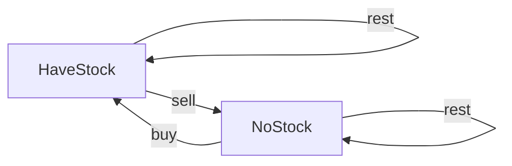

# Algorithm Framework

## Data Structure

### Linked List

```python
'''
基本的单链表节点
'''
class Node:
		def __init__(self, val):
      self.val = val
      self.next = None
      
    def traverse(self):
      # node.val
      while node:
        node = node.next
        
    def traverse(self):
      # nodel.val
      self.traverse(node.next)
```

### Binary Tree

```python
'''
基本的二叉树节点
'''
class TreeNode:
  def __init__(self, val):
    self.val = val
    self.left = None
    self.right = None

	def traverse(self):
    # 前序遍历
    self.traverse(self.left)
    # 中序遍历
    self.traverse(self.right)
    # 后序遍历
    
'''
N叉树
'''
class NTreeNode:
  def __init__(self, val):
    self.val = val
    self.children = []

	def traverse(self):
    for child in children:
      self.traverse(child)
```

## Dynamic Programming

**首先，动态规划问题的一般形式就是求最值**。动态规划其实是运筹学的一种最优化方法，只不过在计算机问题上应用比较多，比如说让你求**最长**递增子序列呀，**最小**编辑距离呀等等。

既然是要求最值，核心问题是什么呢？**求解动态规划的核心问题是穷举**。因为要求最值，肯定要把所有可行的答案穷举出来，然后在其中找最值呗。

- 首先，动态规划的穷举有点特别，因为这类问题**存在「重叠子问题」**，如果暴力穷举的话效率会极其低下，所以需要「备忘录」或者「DP table」来优化穷举过程，避免不必要的计算。

- 而且，动态规划问题一定会**具备「最优子结构」**，才能通过子问题的最值得到原问题的最值。

- 另外，虽然动态规划的核心思想就是穷举求最值，但是问题可以千变万化，穷举所有可行解其实并不是一件容易的事，只有列出**正确的「状态转移方程」**才能正确地穷举。

以上提到的**重叠子问题、最优子结构、状态转移方程**就是动态规划三要素。具体什么意思等会会举例详解，但是在实际的算法问题中，**写出状态转移方程是最困难的**，这也就是为什么很多朋友觉得动态规划问题困难的原因，我来提供我研究出来的一个思维框架，辅助你思考状态转移方程：

**明确 base case -> 明确「状态」-> 明确「选择」 -> 定义 dp 数组/函数的含义**。

**方法：**

- **暴力递归**
- **带memory的递归（自顶向下）**
- **dp数组迭代解法（自底向上）**

---

### Stock Problem

[买卖股票的最佳时机](https://leetcode-cn.com/problems/best-time-to-buy-and-sell-stock/solution/)

[买卖股票的最佳时机 II](https://leetcode-cn.com/problems/best-time-to-buy-and-sell-stock-ii/)

[买卖股票的最佳时机 III](https://leetcode-cn.com/problems/best-time-to-buy-and-sell-stock-iii/)

[买卖股票的最佳时机 IV](https://leetcode-cn.com/problems/best-time-to-buy-and-sell-stock-iv/)

[最佳买卖股票时机含冷冻期](https://leetcode-cn.com/problems/best-time-to-buy-and-sell-stock-with-cooldown/)

[买卖股票的最佳时机含手续费](https://leetcode-cn.com/problems/best-time-to-buy-and-sell-stock-with-transaction-fee/)




```python
'''
dp[i][k][0 or 1]
0 <= i <= n-1, 1 <= k <= K
n 为天数，大 K 为最多交易数
此问题共 n × K × 2 种状态，全部穷举就能搞定。
'''
# base case
for k in range(k+1):
  dp[0][k][0] = 0
  dp[0][k][1] = -prices[0]
# iteration
for 0 <= i < n:
    for 1 <= k <= K:
        for s in {0, 1}:
            dp[i][k][s] = max(buy, sell, rest)
return max(dp[-1][k][0])
```


---

### Rubbery Problem


## Backtrack

**解决一个回溯问题，实际上就是一个决策树的遍历过程**。你只需要思考 3 个问题：

1、路径：也就是已经做出的选择。

2、选择列表：也就是你当前可以做的选择。

3、结束条件：也就是到达决策树底层，无法再做选择的条件。

```python
'''
其核心就是 for 循环里面的递归，在递归调用之前「做选择」，在递归调用之后「撤销选择」，特别简单。
'''
result = []
def backtrack(路径, 选择列表):
    if 满足结束条件:
        result.add(路径)
        return

    for 选择 in 选择列表:
      # 做选择
      将该选择从选择列表移除
      路径.add(选择)
      backtrack(路径, 选择列表)
      # 撤销选择
      路径.remove(选择)
      将该选择再加入选择列表
```

#### Conclusion

回溯算法就是个多叉树的遍历问题，关键就是在前序遍历和后序遍历的位置做一些操作，算法框架如下：

```
def backtrack(...):
    for 选择 in 选择列表:
        做选择
        backtrack(...)
        撤销选择
```

**写** **`backtrack`** **函数时，需要维护走过的「路径」和当前可以做的「选择列表」，当触发「结束条件」时，将「路径」记入结果集**。

其实想想看，回溯算法和动态规划是不是有点像呢？我们在动态规划系列文章中多次强调，动态规划的三个需要明确的点就是「状态」「选择」和「base case」，是不是就对应着走过的「路径」，当前的「选择列表」和「结束条件」？

某种程度上说，动态规划的暴力求解阶段就是回溯算法。只是有的问题具有重叠子问题性质，可以用 dp table 或者备忘录优化，将递归树大幅剪枝，这就变成了动态规划。而今天的两个问题，都没有重叠子问题，也就是回溯算法问题了，复杂度非常高是不可避免的。

## Breath First Search

BFS 相对 DFS 的最主要的区别是：**BFS 找到的路径一定是最短的，但代价就是空间复杂度比 DFS 大很多**，至于为什么，我们后面介绍了框架就很容易看出来了。

**问题的本质就是让你在一幅「图」中找到从起点** **`start`** **到终点** **`target`** **的最近距离，这个例子听起来很枯燥，但是 BFS 算法问题其实都是在干这个事儿**

```python
'''
计算从起点 start 到终点 target 的最近距离
'''
def BFS(start, target):
    queue = []
    visited = set()
    queue.append(start)
    visited.add(start)
    step = 0  # 记录扩散的步数
    while queue:
        sz = len(queue)
        # 将当前队列中的所有节点向四周扩散
        for i in range(sz) {
            cur = queue.pop()
            # 划重点：这里判断是否到达终点
            if cur is target:
                return step
            # 将 cur 的相邻节点加入队列, adj()为cur上下左右的点
            for x in cur.adj():
                if x not in visited:
                    queue.append(x)
                    visited.add(x)
        # 划重点：更新步数在这里
        step += 1
```

## Binary Search

```python
def binarySearch(nums: list, target: int):
    left, right = 0, len(nums)-1
    while ___ :
        mid = left + (right - left) // 2
        if nums[mid] == target:
            ___
        elif nums[mid] < target:
            left = ___
        elif nums[mid] > target:
            right = ___
    return ___
```

**分析二分查找的一个技巧是：不要出现 else，而是把所有情况用 else if 写清楚，这样可以清楚地展现所有细节**。本文都会使用 else if，旨在讲清楚，读者理解后可自行简化。

其中 `___` 标记的部分，就是可能出现细节问题的地方，当你见到一个二分查找的代码时，首先注意这几个地方。后文用实例分析这些地方能有什么样的变化。

另外声明一下，计算 mid 时需要防止溢出，代码中 `left + (right - left) / 2` 就和 `(left + right) / 2` 的结果相同，但是有效防止了 `left` 和 `right` 太大直接相加导致溢出。

**为什么 while 循环的条件中是 <=，而不是 <**？

答：因为初始化 `right` 的赋值是 `nums.length - 1`，即最后一个元素的索引，而不是 `nums.length`。

这二者可能出现在不同功能的二分查找中，区别是：前者相当于两端都闭区间 `[left, right]`，后者相当于左闭右开区间 `[left, right)`，因为索引大小为 `nums.length` 是越界的。

我们这个算法中使用的是前者 `[left, right]` 两端都闭的区间。**这个区间其实就是每次进行搜索的区间**。

## Sliding Windows

[76.最小覆盖子串](https://leetcode-cn.com/problems/minimum-window-substring) :ballot_box_with_check:

[567.字符串的排列](https://leetcode-cn.com/problems/permutation-in-string)​ :ballot_box_with_check:

[438.找到字符串中所有字母异位词 :ballot_box_with_check:](https://leetcode-cn.com/problems/find-all-anagrams-in-a-string)

[3.无重复字符的最长子串​ :ballot_box_with_check:](https://leetcode-cn.com/problems/longest-substring-without-repeating-characters)

```python
'''
滑动窗口算法框架
'''
def slidingWindow(s: str, t: str) {
		need, window = defaultdict(), defaultdict()
    for c in t: need[c]+=1;
    left, right = 0, 0 
    valid = 0
    while right < len(s):
        # c 是将移入窗口的字符
        char c = s[right];
        # 右移窗口
        right++;
        # 进行窗口内数据的一系列更新
        ...

        '''
        debug 输出的位置
        ''' 
        print("window: [%d, %d)\n", left, right);

        # 判断左侧窗口是否要收缩
        while window needs shrink:
            # d 是将移出窗口的字符
            char d = s[left]
            # 左移窗口
            left += 1
            # 进行窗口内数据的一系列更新
            ...
```

**其中两处** **`...`** **表示的更新窗口数据的地方，到时候你直接往里面填就行了**。

而且，这两个 `...` 处的操作分别是右移和左移窗口更新操作，等会你会发现它们操作是完全对称的。这个算法技巧的时间复杂度是 O(N)，比字符串暴力算法要高效得多。