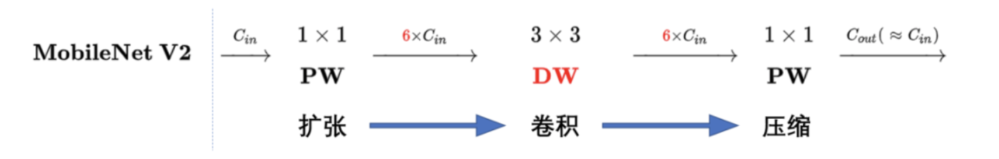
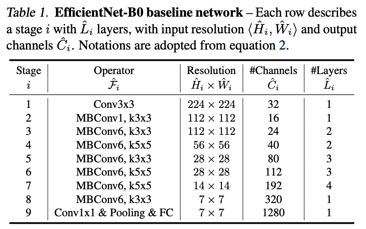
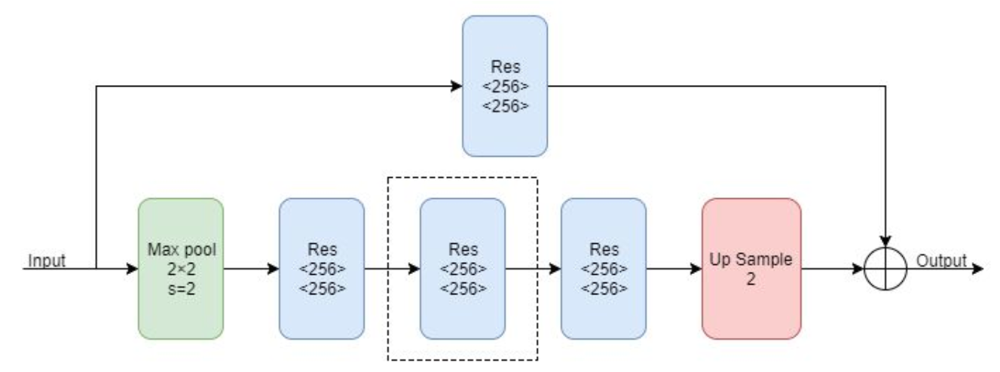
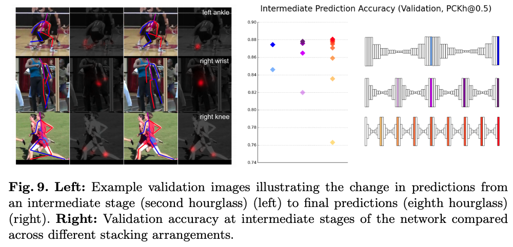

## Inception 

### Version 1

#### **:star2: Highlight：**

1. 采用<u>**不同大小的卷积核意味着不同大小的感受野，最后拼接意味着不同尺度特征的融合**</u>；
2. 之所以卷积核大小采用1、3和5，主要是为了方便对齐。**<u>设定卷积步长stride=1之后，只要分别设定pad=0、1、2，那么卷积之后便可以得到相同维度的特征，然后这些特征就可以直接拼接在一起了</u>**；
3. 文章说很多地方都表明pooling挺有效，所以Inception里面也嵌入了。
4. 网络越到后面，特征越抽象，而且每个特征所涉及的感受野也更大了，因此随着层数的增加，3x3和5x5卷积的比例也要增加。

但是，<u>**使用5x5的卷积核仍然会带来巨大的计算量**</u>。 为此，文章借鉴NIN2，采用1x1卷积核来进行通道削减。

例如：上一层的输出为100x100x128，经过具有256个输出的5x5卷积层之后(stride=1，padding=2)，输出数据为100x100x256。其中，卷积层的参数为128x5x5x256。假如上一层输出先经过具有32个输出的1x1卷积层，再经过具有256个输出的5x5卷积层，那么最终的输出数据仍为为100x100x256，但卷积参数量已经减少为128x1x1x32 + 32x5x5x256，大约减少了4倍。

#### **Inception Block结构：**


#### **:star: Highlight：**


### **Version 2**

**模型改进：**

1. 使用BN层，将每一层的输出都规范化到一个N(0,1)的正态分布，这将有助于训练，因为下一层**<u>不必学习输入数据中的偏移，并且可以专注与如何更好地组合特征</u>**（也因为在v2里有较好的效果，BN层几乎是成了深度网络的必备）；**<u>BN层能够提升模型的训练速度</u>**

**Inception Block结构：**


#### **Result on ImageNet：**


### Version 4

#### **Inception Block：**


#### Conclusion：

- Inception网络模式人工痕迹太重，模型太复杂。容易过拟合。
- 模式属于split-transform-merge模式，每一路通道进行单独转换，最后所有通道concate（级联）
- 版本越往后面参数越多，训练所花费的时间和资源越多

## ResNet

- **:star: Highlight**


## Wide Residual Network (WRN)


#### :star2: **Highlight:**

1. Detailed experiment of ResNet
2. Novel **widened** architecture for ResNet block
3. New way of utilising **Dropout** 

提升residual block表征能力:

1. Add more Conv per block
2. Widen the Conv layer by adding more feature plane
3. Increase filter size

## ResNext

#### **:star2: Highlight：**

1. 在ResNet模型的基础上增加了Residual Block的宽度（通道），检验了模型宽度所带来的精度提升。
2. 最后所有通道仅仅是相加起来便可以融合。符合split-transform-merge模式
3. 进一步验证了split-transform-merge模式的普遍性和有效性

#### **ResNext Block：**


- 左ResNet							右ResNext（32 Paths）


- a为基本的ResNext Block单元
- 如果将最后1x1的合并到一起，等价于网络b中拥有和Inception-ResNet的结构（concate）
- 进一步将输入的1x1合并，等价于网络c中和通道分组卷积网络结构类似

#### **Conclusion：**

- ResNext-101 （32x4d）大小和Inception v4相当，精度略差。但是训练速度快很多
- ResNext-101 （64x4d）大小和Inception-ResNet大一点，精度相当或略差，速度快非常多
- 结构简单，可以防止对特定数据集的过拟合。

## Shake-Shake regularization  


**Formula:**
$$
 x_{i+1} = x_i + \alpha\mathcal{F}(x_i, \mathcal{W}_i^{(1)}) + (1-\alpha)\mathcal{F}(x_i, \mathcal{W}_i^{(2)})
$$
#### Conclusion:

- 类似于dropout, 将本来属于一个pipeline里面的分成两步来做, 增加随机性

##  VGG

#### **:star2: Highlight**

1. 整个网络都使用了同样大小的卷积核尺寸（3 x 3）和最大池化尺寸（2 x 2）
2. 1 x 1卷积的意义主要在于线性变换，而输入通道数和输出通道数不变，没有发生降维。
3. 两个3 x 3的卷积层串联相当于1个5 x 5的卷积层，即一个像素会跟周围5 x 5的像素产生关联，可以说感受野大小为5 x 5。而3个3 x 3的卷积层串联的效果则相当于1个7 x 7的卷积层。除此之外，3个串联的3 x 3的卷积层，拥有比1个7 x 7的卷积层更少的参数量，只有后者的(3 x 3 x 3)/(7 x 7)=55%。最重要的是，3个3 x 3的卷积层拥有比1个7 x 7的卷积层更多的非线性变换（前者可以使用三次ReLU激活函数，而后者只有一次），使得CNN对特征的学习能力更强。
4. VGGNet在训练时有一个小技巧，先训练级别A的简单网络，再复用A网络的权重来初始化后面的几个复杂模型，这样训练收敛的速度更快。在预测时，VGG采用Multi-Scale的方法，将图像scale到一个尺寸Q，并将图片输入卷积网络计算。然后在最后一个卷积层使用滑窗的方式进行分类预测，将不同窗口的分类结果平均，再将不同尺寸Q的结果平均得到最后结果，这样可提高图片数据的利用率并提升预测准确率。在训练中，VGGNet还使用了Multi-Scale的方法做数据增强，将原始图像缩放到不同尺寸S，然后再随机裁切224x224的图片，这样能增加很多数据量，对于防止模型过拟合有很不错的效果。


## SE-Net

#### **:star2: Highlight：**

通过feature recalibration（重校正）给channel增加权重，提升每个channel的表征特性（channel和feature map之间的明确关系）


- 通过Global Pooling将输出的feature map pooling 至 $1 \times 1 \times C$
- 将其映射至FC layer 至 $1\times 1\times \frac{C}{r}$ 并通过非线性激活函数Relu
- 将上一步输出映射至 $1\times 1\times C$ 的FC layer。两次FC的操作是为了
  - 具有更多非线性，更好拟合通道间相关性 
  - 降低参数量和
- 通过sigmoid之后将$1 \times 1 \times C$ 的权重与$H \times W \times C$ 一一相乘得到结果

#### 模型变体：


## Shuffle Net

#### **:star2: Highlight：**

- 轻便， $shuffle$  operation help information flowing across feature channel

#### **Group Convolution：**


- 将channel数 c 分成g各组，每个组的channel数量为c/g
- 每个组的输出结果进行concatenate组合恢复到原来的channel数量
  - e.g. 假设原来输入通道数：256，输出通道数：256，kernal size： 3x3，overall parameter：256x3x3x256 = 589824
  - 使用group channel之后：假设group = 8，每个group通道：256/8 = 32，overall parameter：8x32x3x3x32 = 73728

#### **Channel Shuffle Operation:**


- a：两个conv之间没有交流，每个output channel只与input channels 相关
- b：input channel 和 output channel之间充分交流
- c：使用shuffle操作达到 **b** 的效果

#### **ShuffleNet Unit**


- a：vanilla ResNext
- b：使用1x1 group conv替代1x1 conv 并加入了channel shuffle
- c：ShuffleNet with stride **enlarge channel size with little extra computation cost**

## Xception

- **Deepwise Convolution Block:**

  ```python
  class SeparableConv2d(nn.Module):
      def __init__(self,in_channels,out_channels,kernel_size=1,stride=1,padding=0,dilation=1,bias=False):
          super(SeparableConv2d,self).__init__()
  
          self.conv1 = nn.Conv2d(in_channels,in_channels,kernel_size,stride,padding,dilation,groups=in_channels,bias=bias)
          self.pointwise = nn.Conv2d(in_channels,out_channels,1,1,0,1,1,bias=bias)
  
      def forward(self,x):
          x = self.conv1(x)
          x = self.pointwise(x)
          return x
  ```

  - 先经过一个**group为** `in_channel` **的conv2d**，再经过1x1 conv

## Octave Convolution

## Siamese Network

- 模型作用：**少样本**图像分类，图像匹配，目标追踪

- :star2: Highlight：

  - 相似性度量，淡化label作用

  

  - 步骤：

  1. 输入为**一对**图片，不需要label；若来自同一class，则为1，反之为0。
  2. 两张图片经过同一个共享参数的神经网络
  3. 将最后一层的输出作为**encoding**，度量两个encoding的相似性(欧式距离)
  4. 输出为score，越高代表越相似。

## MobileNet

### v1

```python
class DepthSeperateConv(nn.Module):
    def __init__(self, inp, oup, stride):
        super(DepthSeperateConv, self).__init__()
				self.depthwise_conv = nn.Conv2d(inp, 1, 3, 3, stride, bias=False)
        self.pointwise_conv = nn.Conv2d(1, oup, 1, 1, stride, bias=False)
        self.relu = nn.ReLU()
        self.relu6 = nn.ReLU6()
        self.bn = nn.BatchNorm2d()
        
        layers = [self.depthwise_conv, 
                  self.bn, self.relu6, 
                  self.pointwise_conv, 
                  self.bn, 
                  self.relu]
        self.conv = nn.Sequential(*layers)

    def forward(self, x):
        x = self.conv(x)
        return x
```


- **普通卷积**: 
  - 参数量：$D_K^2 \times M \times N$  Dk是kernel的size  M是input channel，N是output channel
  - 计算量：$D_K^2 \times M \times N \times D_F^2$  Df是输入feature map的大小

- **可分离卷积:** 将一个卷积层拆分成多个

  - 空间可分离卷积：比如3x3的kernel可以分成一个3x1和一个1x3

  

  - 深度可分离卷积：`depth-separable conv = depthwise conv + pointwise conv`
    - Depthwise
      - 参数量：$D_K^2 \times M \times 1$  
      - 计算量：$D_K^2 \times M \times 1 \times D_F^2$
    - Pointwise
      - 参数量：$1 \times M \times N$  
      - 计算量：$1 \times M \times N \times D_F^2$
    - 参数量：$D_K^2 \times M \times 1 + 1 \times M \times N$ 
    - 计算量: $D_K^2 \times M \times 1 \times D_F^2 + 1 \times M \times N \times D_F^2$


- **V1卷积层:**


- **Relu6:** $ReLU(6)=min(max(0,x),6)$

- #### **实验结果:**

  

  

  

### V2

**ReLU:** 在低维进行ReLU运算，容易造成信息丢失；在高维做ReLU运算，信息的丢失较少。


#### **MobileNetV2 Block:**

```python
class InvertedResidual(nn.Module):
    def __init__(self, inp, oup, stride, expand_ratio):
        super(InvertedResidual, self).__init__()
        self.stride = stride
        assert stride in [1, 2]

        hidden_dim = int(round(inp * expand_ratio))
        self.use_res_connect = self.stride == 1 and inp == oup

        layers = []
        if expand_ratio != 1:
            # pw
            layers.append(ConvBNReLU(inp, hidden_dim, kernel_size=1))
        layers.extend([
            # dw
            ConvBNReLU(hidden_dim, hidden_dim, stride=stride, groups=hidden_dim),
            # pw-linear
            nn.Conv2d(hidden_dim, oup, 1, 1, 0, bias=False),
            nn.BatchNorm2d(oup),
        ])
        self.conv = nn.Sequential(*layers)

    def forward(self, x):
        if self.use_res_connect:
            return x + self.conv(x)
        else:
            return self.conv(x)
```


- **Linear Bottleneck：**最后一层的**<u>ReLU6</u>**换成**<u>Linear</u>** (去掉activation layer即可)
- **Expansion Layer：**由于dw深度卷积只能在低维工作，效果不好。所以使用**<u>通道扩张</u>**，即在dw前加入一层pw来升维




- **Inverted residuals：**由于expansion layer的存在，与**先降维后升维**的ResNet刚好相反。


### V3

#### **Related Work**

1. MobileNetV1: depth-wise separable conv提升了计算效率
2. MobileNetV2: 使用反转residual block和linear block
3. MnasNet: 在MobileNetV2基础上引入squeeze and excitation模块
4. ShuffleNet: 使用了group conv和channel shuffle operation减少Multi-Adds操作
5. CondenseNet: 在training stage学习group conv来保证dense connections between layers for re-use
6. ShiftNet: 提出了shift operation interleaved with point-wise conv来代替昂贵的spatial conv

#### **h-swish Activation:**

$$
f(x)=x \cdot \frac{ReLU6(x+3)}{6}
$$

- 具备无上界、有下界、平滑、非单调等特性
- hard形式是soft形式的低精度化

**NAS Search Space**: combination of above

#### **Architecture**


#### **Lite Reduced-ASPP**


## EfficientNet (ICML 2019)

#### **Abstract**

Propose a new scaling method that uniformly scales all dimensions of depth/width/resolution using

 `Compound Coefficient`. **NAS** a baseline network and scale it up to obtain a family of models.


#### **Compound Model Scaling**

We can define a ConvNets as:
$$
\mathcal{N} =\mathcal{F}^{k}\bigodot...\bigodot\mathcal{F_1}\bigodot\mathcal{F_1}(X_1) =\bigodot_{i = 1...s}\mathcal{F}^{L_i} (X_{<H_i,W_i,C_i>})
$$
where $\mathcal{F}_{i}^{L_i}$ denotes layer $\mathcal{F}i$ is repeated $L_i$ times in stage $i$ 

在此，通过uniform constant ratio，使得每层在做rescale的时候，depth/width/resolution以固定的ratio同时优化:


- Single dimension scaling
  - **Depth: **richer and more complex features, and generalise well on new tasks
  - **Width: **
    - capture more fine-grained features and are easier to train. 
    - extremely wide but shallow networks tend to have difficulties in capturing higher level features 
  - **Resolution: **the accuracy gain **diminishes** for very high resolutions 


- Compound scaling: higher resolution image require deep network to capture similar features that include more pixels in bigger image. — **Constraint $d \cdot w^2 \cdot r^2 \approx 2$**


#### **EfficientNet Architecture**

- MBC is mobile inverted bottleneck — mobilenetv2 + Squeeze and Excitation
- Add Squeeze-and-Excitation optimisation



#### **Result**


## Two at Once: Enhancing Learning and Generalization Capacities via IBN-Net  (ECCV 2018)

#### **Abstract**

- CNN architecture improve performance on a single task of a single domain and not **generalisable** 

#### **IBN Block**


#### **Conclusion**

- Our work concludes the role of IN and BN layers in CNNs: **IN introduces appearance invariance and improves generalization while BN preserves content information in discriminative features.** 
- IN具有提高泛化性能，BN具有保证content的语义信息

## An Energy and GPU-Computation Efficient Backbone Network for Real-Time Object Detection (CVPR 2019)

#### **Abstract**

- 提出一个能够充分利用各层feature map且非常高效的网络。2x faster and 1.6x ～ 4.1x consumption reduced


#### **Factors of efficient Network Design**

- 减少FLOPs和模型size并不代表减少GPU inference time & real energy consumption
- 拥有同样FLOPs的ShuffleNet V2和MobileNet V2，前者比后者更快
- SqueezeNet比AlexNet模型大小小50x，前者消耗能量比后者更多

1. **Memory Access Cost**
   - 能量消耗主要来源CNN的内存访问(memory access)
   - 导致这个的主要原因是intermediate activation memory footprint，这归咎于filter parameter和intermediate feature maps大小。
2. **GPU-Computation Efficiency**
   - GPU并行计算能力在处理大tensor效果更好，所以拆分大的卷积操作会降低GPU计算效率。(7x7卷积拆分成3个3x3的卷积能够降低FLOPs，但是并不能加速训练)。这说明，在设计网络的时候，最好压缩网络层数。
   - 尽管depthwise conv和1x1 conv能够降低FLOPs，这对GPU的计算效率有害。所以这里使用了FLOPs per second (FLOP/s)来计算真实的GPU inference time from total FLOPs。

#### **Results**


## Stacked Hourglass Networks (ECCV 2016)

#### **Abstract**

- 能够通过不同的尺寸来巩固和获取最优的空间关系特征
- 基于连续的上采样和下采样堆叠

#### **Intermediate Supervision (中间监督)**

- 大多数高阶特征只在低分辨率下出现，如果在网络上采样后进行监督，则无法在更大的全局上下文中重新评估这些特征。
- hourglass的loss都是**单独计算**，这样能够对每个hourglass module进行再评估。意思是每个hourglass中间还原的feature map都会参与最终loss的计算。

#### **Network**

```python
Class HourglassModule(nn.Module):
		def __init__(self):
        self.res_block = res_block()
        self.maxpool = nn.MaxPool2d((2,2), stride=2)
        self.upsample = nn.NearestInterpretation()
      
    def forward(self, x):
      	x = self.maxpool(x)
				out = self.res_block(x)
        for _ in range(3):
          x = self.res_block(x)
        x = self.upsample(x)
        res = x + out
        return res
```





## CSPNet: A New Backbone that can Enhance Learning Capability of CNN (CVPR 2020)

#### **Abstract**

- Previous work relies on costly computation resources. 过去的模型依赖计算强大的资源
- 提出了Cross Stage Partial Network来缓解该问题
- 问题归咎于网络内部重复的梯度信息
- 能够与目前所有网络结合


#### Result

- 在分类网络中，能够降低计算量，对精度提升很小
- 在检测网络中，能够降低计算量，而且对精度提升巨大

## AN IMAGE IS WORTH 16X16 WORDS: TRANSFORMERS FOR IMAGE RECOGNITION AT SCALE (Need to be finished)

### Abstract

### Related Work

- Transformer是为机器翻译设计的，在超大语料库做训练，特定语料库finetune即可使用在特定任务中
- 过去的transformer由于计算量的缘故，只用在local或相邻的pixel而不是global pixel。随着sparse transformer的发明，通过逼近的方法，self-attention可以用在图像领域

### Vision Transformer(VIT)

