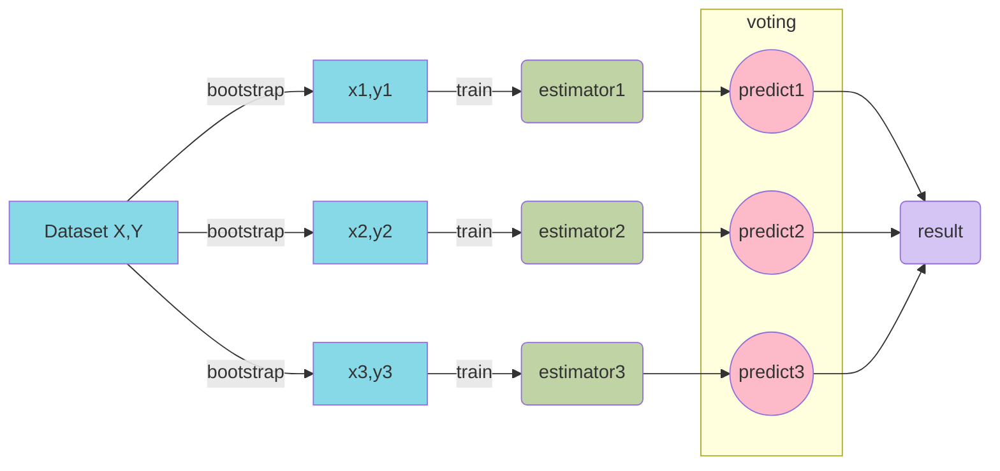
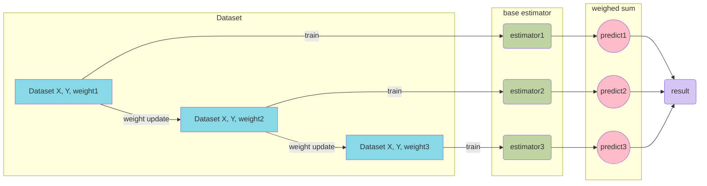
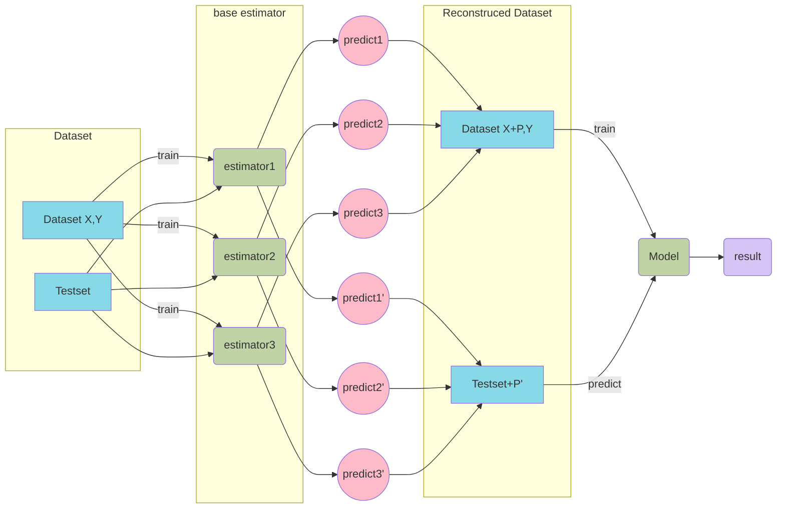

# Machine Learning

## Decision Tree

### 1. ID3

信息熵越大，信息样本纯度越低。ID3是根据**信息增益**来度量特征选择，选择**信息增益**最大的特征进行分裂。采用自顶向下的贪婪搜索遍历决策树空间：

1. 初始化特征集合和数据集合
2. 计算数据集合信息熵和所有特征的条件熵，选择信息增益最大的特征作为决策节点
3. 更新数据集合和特征集合（删除上一步使用的特征，并按照特征值来划分不同分支的数据集合）
4. 重复2，3，若子集包含单一特征，则为叶子节点

### 2. C4.5

利用**信息增益比**作为特征选择，引入**剪枝策略**和对缺失值有一定的鲁棒性。

### 3. CART

使用二分算法，简化决策树的规模，提高效率

- **分裂：**二叉树递归划分过程，输入和特征选择既可以是连续也可以是离散，CART没有停止准则，会一直生长下去
- **剪枝：**采用代价复杂度剪枝，对整体性能贡献最小的那个分裂节点作为剪枝对象，直到只剩下根节点。CART会产生一系列的嵌套剪枝树，从中选择最优的一棵
- **树选择：**用单独的测试集评估每一刻剪枝树的预测性能

**Gini指数：**反映了从数据集中随机抽取两个样本，其类别标记不一致的概率。因此，指数越小，纯度越高。

### 4. 总结

- **划分标准的差异：**ID3 使用信息增益偏向特征值多的特征，C4.5 使用信息增益率克服信息增益的缺点，偏向于特征值小的特征，CART 使用基尼指数克服 C4.5 需要求 log 的巨大计算量，偏向于特征值较多的特征。
- **使用场景的差异：**ID3 和 C4.5 都只能用于分类问题，CART 可以用于分类和回归问题；ID3 和 C4.5 是多叉树，速度较慢，CART 是二叉树，计算速度很快；
- **样本数据的差异：**ID3 只能处理离散数据且缺失值敏感，C4.5 和 CART 可以处理连续性数据且有多种方式处理缺失值；从样本量考虑的话，小样本建议 C4.5、大样本建议 CART。C4.5 处理过程中需对数据集进行多次扫描排序，处理成本耗时较高，而 CART 本身是一种大样本的统计方法，小样本处理下泛化误差较大 ；
- **样本特征的差异：**ID3 和 C4.5 层级之间只使用一次特征，CART 可多次重复使用特征；
- **剪枝策略的差异：**ID3 没有剪枝策略，C4.5 是通过悲观剪枝策略来修正树的准确性，而 CART 是通过代价复杂度剪枝。

## Ensemble Modelling

### 1. Bagging

Bootstrap aggregating，每个Base Estimator会对**训练集**进行有放回抽样得到子训练集。最后通过投票法预测，票数多的为结果。

- **整体模型的期望等于基模型的期望，这也就意味着整体模型的偏差和基模型的偏差近似。**
- **整体模型的方差小于等于基模型的方差，当且仅当相关性为 1 时取等号，随着基模型数量增多，整体模型的方差减少，从而防止过拟合的能力增强，模型的准确度得到提高。**但是，模型的准确度一定会无限逼近于 1 吗？并不一定，当基模型数增加到一定程度时，方差公式第一项的改变对整体方差的作用很小，防止过拟合的能力达到极限，这便是准确度的极限了。

#### 1.1 Random Forest

Random Forest（随机森林），用随机的方式建立一个森林。RF 算法由很多决策树组成，每一棵决策树之间没有关联。建立完森林后，当有新样本进入时，每棵决策树都会分别进行判断，然后基于投票法给出分类结果。

**1.1.1 思想**

Random Forest（随机森林）是 Bagging 的扩展变体，它在以决策树为基学习器构建 Bagging 集成的基础上，进一步在决策树的训练过程中引入了随机特征选择，因此可以概括 RF 包括四个部分：

1. 随机选择样本（放回抽样）；
2. 随机选择特征；
3. 构建决策树；
4. 随机森林投票（平均）。

随机选择样本和 Bagging 相同，采用的是 Bootstrap 自助采样法；**随机选择特征是指在每个节点在分裂过程中都是随机选择特征的**（区别与每棵树随机选择一批特征）。

这种随机性导致随机森林的偏差会有稍微的增加（相比于单棵不随机树），但是由于随机森林的“平均”特性，会使得它的方差减小，而且方差的减小补偿了偏差的增大，因此总体而言是更好的模型。

随机采样由于引入了两种采样方法保证了随机性，所以每棵树都是最大可能的进行生长就算不剪枝也不会出现过拟合。

**1.1.2 优点**

1. 在数据集上表现良好，相对于其他算法有较大的优势
2. 易于并行化，在大数据集上有很大的优势；
3. 能够处理高维度数据，不用做特征选择。

### 2. Boosting

训练过程为阶梯状，串行训练。每一个base estimator学习是基于上一个base estimator的基础上进行训练，最终结果是所有base estimator的加权平均值

- 整体模型的方差等于基模型的方差，如果基模型不是弱模型，其方差相对较大，这将导致整体模型的方差很大，即无法达到防止过拟合的效果。因此，Boosting 框架中的基模型必须为弱模型。
- 此外 Boosting 框架中采用基于贪心策略的前向加法，整体模型的期望由基模型的期望累加而成，所以随着基模型数的增多，整体模型的期望值增加，整体模型的准确度提高。

#### 2.1 Adaboost

AdaBoost（Adaptive Boosting，自适应增强），其自适应在于：**前一个基本分类器分错的样本会得到加强，加权后的全体样本再次被用来训练下一个基本分类器。同时，在每一轮中加入一个新的弱分类器，直到达到某个预定的足够小的错误率或达到预先指定的最大迭代次数。**

**2.1.1 思想**

**Adaboost**迭代算法有三步：

1. 初始化训练样本的权值分布，每个样本具有相同权重；
2. 训练弱分类器，如果样本分类正确，则在构造下一个训练集中，它的权值就会被降低；反之提高。用更新过的样本集去训练下一个分类器；
3. 将所有弱分类组合成强分类器，各个弱分类器的训练过程结束后，加大分类误差率小的弱分类器的权重，降低分类误差率大的弱分类器的权重。

#### 2.2 GBDT

GBDT（Gradient Boosting Decision Tree）是一种迭代的决策树算法，该算法由多棵决策树组成，从名字中我们可以看出来它是属于 Boosting 策略。GBDT 是被公认的泛化能力较强的算法。

**2.2.1 思想**

GBDT 由三个概念组成：Regression Decision Tree（即 DT）、Gradient Boosting（即 GB），和 Shrinkage（一个重要演变）

**2.2.2 回归树（Regression Decision Tree）**

如果认为 GBDT 由很多分类树那就大错特错了（虽然调整后也可以分类）。对于分类树而言，其值加减无意义（如性别），而对于回归树而言，其值加减才是有意义的（如说年龄）。GBDT 的核心在于累加所有树的结果作为最终结果，所以 GBDT 中的树都是回归树，不是分类树，这一点相当重要。

回归树在分枝时会穷举每一个特征的每个阈值以找到最好的分割点，衡量标准是最小化均方误差。

#### 2.3 XGBoost

#### 2.4 LightGBM

#### 2.5 XGBoost和LightGBM对比

本节主要总结下 LightGBM 相对于 XGBoost 的优点，从内存和速度两方面进行介绍。

**2.5.1 内存更小**

1. XGBoost 使用预排序后需要记录特征值及其对应样本的统计值的索引，而 LightGBM 使用了直方图算法将特征值转变为 bin 值，且不需要记录特征到样本的索引，将空间复杂度从 $O(2*data)$ 降低为 $O(bin)$ ，极大的减少了内存消耗；
2. LightGBM 采用了直方图算法将存储特征值转变为存储 bin 值，降低了内存消耗；
3. LightGBM 在训练过程中采用互斥特征捆绑算法减少了特征数量，降低了内存消耗。

**2.5.2 速度更快**

1. LightGBM 采用了直方图算法将遍历样本转变为遍历直方图，极大的降低了时间复杂度；
2. LightGBM 在训练过程中采用单边梯度算法过滤掉梯度小的样本，减少了大量的计算；
3. LightGBM 采用了基于 Leaf-wise 算法的增长策略构建树，减少了很多不必要的计算量；
4. LightGBM 采用优化后的特征并行、数据并行方法加速计算，当数据量非常大的时候还可以采用投票并行的策略；
5. LightGBM 对缓存也进行了优化，增加了 Cache hit 的命中率。

### 3. Stacking

全部数据训练好base estimator，每个模型对每个样本进行预测，其**预测值**作为训练样本的**特征值**，最终会得到新的训练样本，然后给予新的训练样本进行训练得到模型，预测最终结果。

