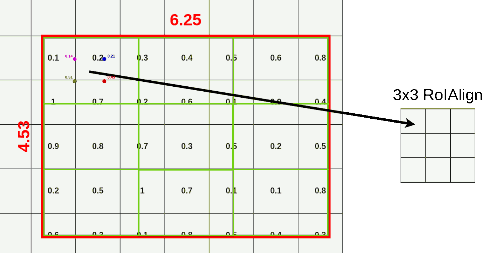

# 概率

## 极大似然估计

假设我们有观测数据集$\mathcal{D}=\{x_i\}^n_{i=1}$, 如果我们希望通过预估参数 $\theta$ 来获得产生数据集的 $\mathcal{D}$ 近似分布 $P_{model}(x;\theta)$, 一个非常自然的想法是既然数据集  已经产 $\mathcal{D}$ 生了, 何不让分布 $P_{model}(x;\theta)$  最大化, 即使得分布 $P_{model}$ 以最大概率产生观测数据集 $ \mathcal{D}$ 中的数据, 这便是最大似然估计的指导思路. 具体地, 我们有
$$
\mathcal{L}(\Theta) = \prod_{i=1}^nP_{model}(x;\Theta) \\

\hat\Theta = \underset{\Theta}{\operatorname{argmax}}\mathcal{L}(\Theta) \\
$$
由于多个概率只的累乘操作容易引起数值溢出的问题，可以求解起等价问题
$$
\mathcal{NLL}=-\sum{\log{P_{model}(x_i;\Theta)r\hat\Theta=\underset{\Theta}{\operatorname{argmin}}}\mathcal{NLL}(\Theta)}
$$
通常称之为负对数似然函数(Negative Log Likelihood)。如果我们将产生观测数据集 $\mathcal{D}=\{x_i\}^n_{i=1}$ 的分布记为 $X \backsim P_{data}$ ,由大数定理可得，当 $n \rightarrow \infty$ 时， 独立同分布的随机变量所产生的样本的算数平均值依概率收敛于期望，故上式可转化为
$$
\hat\Theta = \underset{\Theta}{\operatorname{argmin}} - \sum{\log{P_{model}(x_i;\Theta)}}r = \underset{\Theta}{\operatorname{argmin}} -\frac{1}{n}\sum{\log{P_{model}(x_i;\Theta)}} = \underset{\Theta}{\operatorname{argmin}} - E_{X\backsim P_{data}}\log(P_{model}(x_i;\Theta))
$$
待估函数 $\Theta$ 的求解过程其实是关于分布 $X \backsim P_{data}$ 的期望

#### 信息论

基本思想：一个大概率会发生的事件所拥有的信息量应该非常少，甚至为零。反之，一个小概率发生的事件其所拥有的信息量应该比较大。同时，两个独立事件的信息量具有可叠加性。为了满足这些对信息量进行度量的特征，信息论定义事件 $X = x$ 发生的自信息(self-information)为
$$
\mathcal{I}(x) = -log(P(X=x))
$$
度量了事件  $X = x$ 发生的信息量，而对于随机变量  $X \backsim P$ 所服从分布的总体信息量，我们使用期望
$$
\mathcal{H}(P) = E_{X \backsim P}\mathcal{I}(x) = -E_{X \backsim P}log(P(X=x))
$$
 我们称之为香农熵(shannon entropy)，它描述了依据概率分布 $P$ 进行发生的随机事件所含有的信息量的期望值。既然我们现在可以度量一个概率分布所含有的信息量，一个很自然的想法， 我们可以对不同概率分布的香农熵进行比较, 从而描述不同概率分布之间的差异性。具体地，对于随机变量 $X$ 所服从的两个不同的概率分布 $P$ 和 $Q$，我们使用 KL散度(Kullback-Leibler divergence)来对其差异性进行描述。
$$
KL(P||Q) =E_{X \backsim P}log\frac{P(x)}{Q(x)} \\
= E_{X \backsim P}logP(x) - E_{X \backsim P}logQ(x)
$$
KL散度具有非负性，在P和Q完全相等才会为零。注意，KL散度具有不对称性，即 $KL(P||Q) \neq KL(Q||P)$，描述的是分布 $Q$  逼近分布 $P$ 时所需要的额外信息量。
$$
\begin{equation}
\begin{aligned}
\mathcal{H}(P,Q) &= \mathcal{H}(P) + KL(P||Q) \\ 
&= -E_{X \backsim P}logP(x) + E_{X \backsim P}logP(x) - E_{X \backsim P}logQ(x) \\ 
&= - E_{X \backsim P}logQ(x)
\end{aligned}
\end{equation}
$$
$\mathcal{H}(P,Q)$ 称为分布 $P$ 和 $Q$ 的交叉熵(CrossEntropy)，当我们使用分布 $Q$ 去拟合分布 $P$ 时，是需要使二者的交叉熵尽量小，就能缩小其含有的信息量差异。所以，极大似然估计从信息论的角度来看，是在最小化生产观测数据的分布 $P_{data}$ 和模型分布 $P_{model}$ 之间的交叉熵，即
$$
\hat\Theta = \underset{\Theta}{\operatorname{argmin}}\mathcal{H}(P_{data}, P_{model}) = \underset{\Theta}{\operatorname{argmin}} - E_{X\backsim P_{data}}\log(P_{model}(x_i;\Theta))
$$

## 贝叶斯推断与最大后验估计

贝叶斯学派认为参数其实也是随机变量，服从一定分布。我们可以将对参数的信念和经验用于关于参数的先验分布进行建模，并使用观测数据来对参数进行修正，最后使用休整后的参数分布来进行推断，这便是贝叶斯推断的大致过程。若观测数据集为 $\mathcal{D}=\{x_i\}^n_{i=1}$，在使用分布$\Theta \backsim P(\Theta)$ 表示我们对参数 $\Theta$ 的先验和信念时，我们希望通过数据集 $\mathcal{D}$ 来修正我们对 $\Theta$ 的预估，由贝叶斯公式：
$$
\begin{equation}
\begin{aligned}
\underbrace{P(\Theta|x_1,...,x_n)}_{后验} &= \frac{P(x_1,...,x_n|\Theta)P(\Theta)}{P(x_1,...,x_n)} \\
&\propto \underbrace{P(x_1,...,x_n|\Theta)}_{似然度}\underbrace{P(\Theta)}_{先验}
\end{aligned}
\end{equation}
$$
由上式可知，先验的分布在观测数据不断加入得到似然度后得到修正，参数 $\Theta$ 会从不确定的值不断向部分确定的值靠拢，使得先验从一个蕴含高度不确定性的高熵状态，向其后验的低熵状态靠拢。有了参数的后验分布，就可以进行贝叶斯推断，具体的，对于新的数据 $x_{n+1}$
$$
P(x_{n+1}|x_1,...,x_n) = \int P(x_{n+1}|\Theta)P(\Theta|x_1,...,x_n)d\Theta
$$
在预估新数据 $x_{n+1}$ 的分布时，贝叶斯推断把参数的所有可能性都考虑进去，包括确定性较高的取值和确定性较低的取值，充分利用了所有参数的信息。由上式发现，贝叶斯推断时因为考虑了所有参数的分布信息，致使计算量相比极大似然估计会增大很多，在实际生产中难以应用。例如，当使用神经网络作为预估模型时，贝叶斯推断在参数上进行积分意味着参数每变化一次，神经网络便要做一次前向传播，计算代价非常高。所以我们退而求其次，只使用后验概率最大的参数作为参数的点估计，这样既能将对参数的先验信息代入到模型的推断中，又能节省计算资源：
$$
\begin{equation}
\begin{aligned}
\hat\Theta &= \underset{\Theta}{\operatorname{argmax}}\frac{P(x_1,...,x_n|\Theta)P(\Theta)}{P(x_1,...,x_n)} \\
&\propto \underset{\Theta}{\operatorname{argmax}}P(x_1,...,x_n|\Theta)P(\Theta) \\
&\propto \underset{\Theta}{\operatorname{argmax}}\prod_{i=1}^nP(x_i|\Theta)P(\Theta) \\
&\propto \underset{\Theta}{\operatorname{argmax}}[\sum_{i=1}^n(logP(x_i|\Theta)+logP(\Theta))]
\end{aligned}
\end{equation}
$$
最大后验估计是在最大似然估计的基础上加了参数 $\Theta$ 的先验信息。当 $\Theta$ 的先验取均值为 $0$，协方差矩阵为 $\frac{1}{\lambda}I^2$，即 $\Theta \backsim \mathcal{N}(\Theta; 0, \frac{1}{\lambda}I^2)$，$\Theta$ 的先验正比于 $\lambda\Theta^T\Theta$，此时的先验分布为一个 $L_2$ 正则化项，所以极大似然估计加上一个 $L_2$ 正则化项可解释为最大后验估计的一个近似


## SVM 和 感知机

**一. 简单概括一下SVM：**

SVM 是一种二类分类模型。它的基本思想是在特征空间中寻找间隔最大的分离超平面使数据得到高效的二分类，具体来讲，有三种情况（不加核函数的话就是个线性模型，加了之后才会升级为一个非线性模型）：

- 当训练样本线性可分时，通过硬间隔最大化，学习一个线性分类器，即线性可分支持向量机；
- 当训练数据近似线性可分时，引入松弛变量，通过软间隔最大化，学习一个线性分类器，即线性支持向量机；
- 当训练数据线性不可分时，通过使用核技巧及软间隔最大化，学习非线性支持向量机。

**二. SVM 为什么采用间隔最大化（与感知机的区别）：**

当训练数据线性可分时，存在无穷个分离超平面可以将两类数据正确分开。感知机利用误分类最小策略，求得分离超平面，不过此时的解有无穷多个。线性可分支持向量机利用间隔最大化求得最优分离超平面，这时，解是唯一的。另一方面，此时的分隔超平面所产生的分类结果是最鲁棒的，对未知实例的泛化能力最强。

**三. SVM的目标（硬间隔）：**

有两个目标：第一个是**使间隔最大化**，第二个是**使样本正确分类，**由此推出目标函数：
$$
目标一 （最大化间隔）：\ \ \underset{w,b}{\operatorname{min}}\frac{1}{2}||w||^2 \\
目标二 （使样本分类正确）\ \ y_i(w^Tx_i+b)\ge1, i=1,2,3...
$$
稍微解释一下，w是超平面参数，目标一是从点到面的距离公式化简来的，具体不展开，目标二就相当于感知机，只是把大于等于0进行缩放变成了大于等于1，为了后面的推导方便。有了两个目标，写在一起，就变成了svm的终极目标：
$$
终极目标：\ \ \underset{w,b}{\operatorname{min}}\frac{1}{2}||w||^2 \\
s.t. \ y_i(w^Tx_i+b)\ge1, \forall i
$$
**四. 软间隔：**

不管直接在原特征空间，还是在映射的高维空间，我们都假设样本是线性可分的。虽然理论上我们总能找到一个高维映射使数据线性可分，但在实际任务中，寻找一个合适的核函数核很困难。此外，由于数据通常有噪声存在，一味追求数据线性可分可能会使模型陷入过拟合，因此，**我们放宽对样本的要求，允许少量样本分类错误**。这样的想法就意味着对目标函数的改变，之前推导的目标函数里不允许任何错误，并且让间隔最大，现在给之前的目标函数加上一个误差，就相当于允许原先的目标出错，引入松弛变量 $\xi \ge 0$
$$
\underset{w,b}{\operatorname{min}}\frac{1}{2}||w||^2 + \sum_{i=1}^{n}\xi_i
$$
那么这个松弛变量怎么计算呢，最开始试图用0，1损失去计算，但0，1损失函数并不连续，求最值时求导的时候不好求，所以引入合页损失（hinge loss）：
$$
L_{hinge}(z) = max(0, 1-z)
$$
理解起来就是，原先制约条件是保证所有样本分类正确，$y_i(w^Tx_i+b)\ge1, \forall i$，现在出现错误的时候，一定是这个式子不被满足了，即 $y_i(w^Tx_i+b)\le1, \forall 错误$ ，衡量一下错了多少呢？因为左边一定小于1，那就跟1比较，因为1是边界，所以用1减去 $y_i(w^Tx_i+b)$ 来衡量错误了多少，所以目标变为（正确分类的话损失为0，错误的话付出代价）：
$$
\underset{w,b}{\operatorname{min}}\frac{1}{2}||w||^2 + \sum_{i=1}^nmax(0, 1-y_i(w^Tx_i+b))
$$
但这个代价需要一个控制的因子，引入C>0，惩罚参数，即：
$$
\underset{w,b}{\operatorname{min}}\frac{1}{2}||w||^2 + C\sum_{i=1}^nmax(0, 1-y_i(w^Tx_i+b))
$$
可以想象，C越大说明把错误放的越大，说明对错误的容忍度就小，反之亦然。当C无穷大时，就变成一点错误都不能容忍，即变成硬间隔。实际应用时我们要合理选取C，C越小越容易欠拟合，C越大越容易过拟合。

**所以软间隔的目标函数为：**
$$
\underset{w,b}{\operatorname{min}}\frac{1}{2}||w||^2 + C\sum_{i=1}^n\xi_i\\
s.t. \ y_i(w^Tx_i+b)\ge1-\xi_i\\ 
\xi_i > 0, \forall i
$$
**SVM的优缺点：**

**优点：**

1. 由于SVM是一个凸优化问题，所以求得的解一定是全局最优而不是局部最优。
2. 不仅适用于线性线性问题还适用于非线性问题(用核技巧)。
3. 拥有高维样本空间的数据也能用SVM，这是因为数据集的复杂度只取决于支持向量而不是数据集的维度，这在某种意义上避免了“维数灾难”。
4. 理论基础比较完善(例如神经网络就更像一个黑盒子)。

**缺点：**

1. 二次规划问题求解将涉及m阶矩阵的计算(m为样本的个数), 因此SVM不适用于超大数据集。(SMO算法可以缓解这个问题)
2. 只适用于二分类问题。(SVM的推广SVR也适用于回归问题；可以通过多个SVM的组合来解决多分类问题)

## 随机变量 random variable

1. 离散随机变量
2. 连续随机变量

### 联合概率 joint probability distribution


### 边缘化 Marginal Distribution

- 任意单位变量都可以通过联合概率分布上求其他变量的和(离散变量)或积分(连续变量)得到
  $$
  已知 \ Pr(x,y) \\
  Pr(x) = \int Pr(x,y) dy \\
  Pr(y) = \int Pr(x,y) dx \\
  $$
  
  $$
  已知 w 是离散变量，z是连续变量 \\
  Pr(x,y) = \sum_w \int Pr(w,x,y,z)dz
  $$
  

### 条件概率 Conditional Probability

- 给定y时x的条件概率 $Pr(x|y)$ ，“|” 可以理解为“给定”

$$
Pr(x|y) = \frac{Pr(x,y)}{\int Pr(x,y)dx} = \frac{Pr(x,y)}{Pr(y)}
$$

$$
Pr(x,y) = Pr(x|y)Pr(y)
$$

### 独立性 Independency

- 若从变量x不能获得变量y，则x和y是独立的
  $$
  Pr(x|y) = Pr(x) \\
  Pr(y|x) = Pr(y) \\
  $$

$$
Pr(x,y) = Pr(x|y)Pr(y) = Pr(x)Pr(y)
$$

### 期望 Mean


## Optimizers

optimizers 通用参数

- 待优化参数：$w$, 目标函数：$f(w)$, 初始learning rate：$a$

- 在每一个epoch t 中：

  1. 计算目标函数关于当前参数的梯度： $g_t=\nabla f(w_t)$

  2. 根据历史梯度计算一阶动量和二阶动量：$m_t = \phi(g_1, g_2, \cdots, g_t); V_t = \psi(g_1, g_2, \cdots, g_t)$

     1. 计算当前时刻的下降梯度：$\eta_t = \alpha \cdot m_t / \sqrt{V_t}$

  4. 根据下降梯度进行更新： $w_{t+1} = w_t - \eta_t$

### SGD

- 一阶动量：$m_t = g_t$;	二阶动量：$V_t = I^2$
- 下降梯度：$\eta_t  = a \cdot g_t$

现在通用的SGD通常指代mini-batch SGD，其迭代次数为每个batch的个数$n$。对于每次迭代，SGD对每个batch求样本的梯度均值然后进行梯度更新。

$$
w_{t+1} = w_t - a \cdot \frac {1} {n} \sum \nabla f(w_t)
$$

### SGD-Momentum

- 一阶动量：$m_t = \beta_1 \cdot m_{t-1} + (1-\beta_1) \cdot g_t$
  -  一阶动量是各个时刻梯度方向的指数移动平均值，约等于最近$1/(1-\beta_1)$个时刻的梯度向量和的平均值
- 主要由此前累积的下降方向所决定

### AdaGrad

自适应学习率

- 二阶动量：$V_t = \sum g_t ^2$：迄今为止所有梯度的平方和
- 梯度下降：$\eta_t = a \cdot \frac{m_t} {\sqrt{V_t}}$

实质上，learning rate 由 $a$ 变成了 $\frac{a} {\sqrt{V_t}}$ 随着迭代时候二阶动量越大，学习率越小

### RMSProp

只关注过去一段时间的梯度变化而非全部变化，这里区别于AdaGrad。避免二阶动量持续累积，导致训练提前结束。

- 二阶动量：$V_t = \beta_2 \cdot V_{t-1} + (1 - \beta_2) \cdot g_t^2$

### Adam

RMSProp + Momentum

结合了一阶动量和二阶动量

- 一阶动量：$m_t = \beta_1 \cdot m_{t-1} + (1-\beta_1) \cdot g_t$
- 二阶动量：$V_t = \beta_2 \cdot V_{t-1} + (1 - \beta_2) \cdot g_t^2$

**实际使用过程，参数默认：**$\beta_1 = 0.9;\beta_2 = 0.999$

### Nadam

Adam + NAG

对学习率有更强约束

- 一阶动量：$m_t = \beta_1 \cdot m_{t-1} + (1-\beta_1) \cdot g_t$
  - 一阶动量NAG：$\hat m_t = \frac{m_t}{1-\prod^{t+1}_{I=1} \beta_i}$
- 二阶动量：$V_t = \beta_2 \cdot V_{t-1} + (1 - \beta_2) \cdot g_t^2$
  - 二阶动量NAG：$\hat V_t = \frac{V_t}{1-\beta_2}\hat m_t$
- 当前下降梯度：$\eta_t = \alpha \cdot \frac{\hat m_t }{ \sqrt{\hat{V_t}}+\epsilon}$

### LookAhead

```pseudocode
Require: Initial params phi_0, objective function L
Require: Sync period k, slow weights step size alpha, optimizer A
	for t = 1,2,... do
		Sync theta_t_0 = phi_(t-1)
		for i = 1,2,...,k do
			sample minibatch of data d~D
			theta_t_i = theta_t_(i-1) + A(L, theta_t_(i-1),d)
		end for
		Perform outer update phi_t = phi_(t-1) + alpha(theta_t_k - phi_(t-1))
	end for 
	return params phi
```

##### slow weights trajectory

- 利用fast weights opt最近的proposal之余却也能保持之前的fast weights
- 此举能够降低效果方差，属于final fast weights的exponential moving average(EMA)

##### fast weights trajectory

- 取决于基优化器在minibatch d上的表现效果

### Comparison

- Adam收敛问题
  - 由于RMSProp和Adam的二阶动量是固定时间窗口的累积，随着时间窗口变化，遇到的数据可能发生巨变，是的$V_t$可能会时大时小，不是单调变化。这在后期的训练有可能导致模型无法收敛。
    - 修正方法：$V_t = max(\beta_2 \cdot V_{t-1} + (1 - \beta_2) \cdot g_t^2,   V_{t-1})$
- 错过全剧最优解问题
  - **自适应学习率算法可能会对前期的特征过拟合，后期才出现的特征难以纠正前期的拟合效果**
    - **修正方法：充分shuffle数据集**
  - 尽管收敛速度快，但是收敛的效果没有SGD好。主要因为后期的学习速率太低了，影响有效收敛。
    - 修正方法：对Adam的学习率下界做约束。
- 核心差异：下降方向
  - SGD下降方向就是该位置的梯度的反方向
  - 带一阶动量的SGD下降方向就是该位置一阶动量的方向
  - 自适应学习率算法每个参数设定了不同的学习率，在不同维度上设定不同的步长。因此其下降方向为scaled的一阶动量方向
- Adam + SGD组合策略
  - 继承了Adam的快速收敛和SGD的精度收敛
- 数据是稀疏的(分类问题)，可以优先考虑自适应学习率算法。回归问题SGD通常更好
- :star2:**RAdam:** 能够估计出自适应率的最大值和变化过程，后期能够更有效收敛，避免局部最优值，对学习率不敏感，在大多数数据集都有非常优秀的表现


## Batch Normalization


**目的:**

- 原论文：BN是为了减少 Internal Convariate Shift（训练集数据分布与预测集数据分布不一致）
- MIT新论文：BN的输入归一化使得优化梯度更加平滑，震荡更少。

**优势：**

1. **减少了人为选择参数**。在某些情况下可以取消 dropout 和 L2 正则项参数,或者采取更小的 L2 正则项约束参数；
2. **减少了对学习率的要求**。现在我们可以使用初始很大的学习率或者选择了较小的学习率，算法也能够快速训练收敛；
3. 可以不再使用局部响应归一化。BN 本身就是归一化网络(局部响应归一化在 AlexNet 网络中存在)
4. **破坏原来的数据分布，一定程度上缓解过拟合**（防止每批训练中某一个样本经常被挑选到，文献说这个可以提高 1% 的精度）。
5. **减少梯度消失，加快收敛速度**，提高训练精度。

**算法流程：**

下面给出 BN 算法在训练时的过程

输入：上一层输出结果 X=x1,x2,...,xm，学习参数 γ,β

1. 计算上一层输出数据的均值，其中，m 是此次训练样本 batch 的大小。

$$
\mu_{\beta} = \frac{1}{m} \sum_{i=1}^m(x_i)
$$

2. 计算上一层输出数据的方差(variance)

$$
\sigma_{\beta}^2 = \frac{1}{m} \sum_{i=1}^m (x_i - \mu_{\beta})^2
$$


3. 归一化处理，得到

$$
\hat x_i = \frac{x_i - \mu_{\beta}}{\sqrt{\sigma_{\beta}^2 + \epsilon}}
$$

其中 ϵ 是为了避免分母为 0 而加进去的接近于 0 的很小值

4. 重构，对经过上面归一化处理得到的数据进行重构，得到

$$
y_i = \gamma \hat x_i + \beta
$$

其中，γ,β 为可学习参数。


注：上述是 BN 训练时的过程，但是当在投入使用时，往往只是输入一个样本，没有所谓的均值 $μ_β$ 和标准差 $σ^2_β$。此时，均值 $μ_β$ 是计算所有 batch $μ_β$ 值的平均值得到，标准差 $σ^2_β$ 采用每个batch $σ^2_β$的无偏估计得到。

## Disharmony between DropOut and BN

**Disharmony:** inconsistent behaviour of neural variance during the switch of networks’ state

**Strategies:**

1. Apply Dropout after all BN layers
   - 在softmax层前加一层Dropout
2. Change Dropout into a more vairance-stable form

## Group Normalisation (ECCV 2018)

### Abstract

- BN的误差会随着batch size的减小而骤增
- BN在训练detection，segmentation模型有着比较大的局限性
- 提出Group Normalization，将channel分成group并计算均值和方差。做normalization
- GN能够独立于batch计算，无需group conv，是单独的一个层

### Formula

- 类似Group Conv一样

- G = 32 by default
  $$
  S_i = \{k|k_N = i_N,[\frac{k_C}{C/G}]=[\frac{i_C}{C/G}]\}
  $$

### Code

```python
def GroupNorm(x, gamma, beta, G, eps=1e−5):
  """
   x: input features with shape [N,C,H,W] 
   gamma, beta: scale and offset, with shape [1,C,1,1] 
   G: number of groups for GN
  """ 
  N, C, H, W = x.shape 
  x = tf.reshape(x, [N, G, C // G, H, W])
  mean, var = tf.nn.moments(x, [2, 3, 4], keep dims=True) 
  x = (x − mean) / tf.sqrt(var + eps)
  x = tf.reshape(x, [N, C, H, W]) 
  return x ∗ gamma + beta
```


## Loss

### Information (信息量)

发生概率越小，信息量越大。假设 X 是一个离散的随机变量
$$
p(x) = Pr(X=x), x \in \chi \\ 
\ \\
I(x_0) = -\log(p(x_0))
$$


### Entropy (熵)

信息量的 **期望** 就是熵，
$$
H(X) = -\sum_{i=1}^{n} p(x_i)\log(p(x_i))
$$
其中，二项分布的熵可以简化成，
$$
H(X) = -p(x)\log(p(x))-(1-p(x))\log(1-p(x))
$$


### Cross-Entropy (相对熵/KL散度[Kullback-Leibler Divergence])

衡量两个分布的差异，**P** 代表真实分布，**Q** 代表模型预测分布，两个分布的差异，也就是Loss，
$$
D_{KL}(p||q) = \sum_{i=1}^{n}p(x_i)\log\frac{p(x_i)}{q(x_i)}
$$
从公示看，Q分布越接近P，散度越小，损失越小。

因为对数函数是凸函数，所以KL散度的值为非负值。


### 交叉熵

$$
\begin{equation}
\begin{aligned}
KL散度 \ \ D_{KL}(p||q) &= \sum_{i=1}^{n}p(x_i)\log\frac{p(x_i)}{q(x_i)} \\&=\sum_{i=1}^{n}p(x_i)\log(p(x_i)) - \sum_{i=1}^{n}p(x_i)\log(q(x_i)) \\
&= -H(p(x)) + [- \sum_{i=1}^{n}p(x_i)\log(q(x_i))]
\end{aligned}
\end{equation}
$$

等式的前半部分是P的熵，后半部分就是交叉熵
$$
交叉熵 \ \ H(p,q) = - \sum_{i=1}^{n}p(x_i)\log(q(x_i))
$$
由于在评估label和predict之间的差距时，前半部分不变，故在优化过程中，只关注交叉熵


### JS散度

解决了KL散度非对称问题
$$
JS(p||q) = \frac{1}{2}KL(p||\frac{p+q}{2})+\frac{1}{2}KL(q||\frac{p+q}{2})
$$


### Wasserstein距离

如果P，Q分布完全没有重叠时，KL散度将没有意义，而JS散度值是一个常数($\log2$)。这样在学习算法中，意味着梯度一只是0，无法学习。

**Wasserstein距离**的度量两个概率分布之间的距离，brew
$$
W(P,Q) = \inf_{\gamma \backsim\prod(P,Q)}\mathbb{E}{(x,y)\backsim\gamma}[||x-y||]
$$
$\prod(P,Q)$ 是P，Q联合分布的集合。从中取(x,y)并计算这对样本距离，样本对距离的**期望值**取到的**下界**就是wasserstein距离


## Bilinear Interpolation

### Linear Interpolation

- 已知两点A B，要在AB中插入一点C，即在AB的连线上插入。可套用一次线性公式：

### 双线性

- 双线性插值通常是为了获得目标位置的像素值，在RoI Align中是为了获得插值位置的value。
  1. 经过作者实验，使用4点插值能获得最好的效果。每个点为RoI Align grid cells的三等分点。

  2. 其中一个点双线性插值公式：假设 p11 (x1, y1), p21 (x2, y1), p12 (x1, y2), p22(x2,y2)为4个已知点，p (x, y)为被插值点

  $$
  P \approx \frac{y2-y}{y2-y1}(\frac{x2-x}{x2-x1}Q11 + \frac{x-x1}{x2-x1}Q21) + \frac{y - y1}{y2-y1}(\frac{x2-x}{x2-x1}Q12 + \frac{x-x1}{x2-x1}Q22)
  $$

  3. 将其余三个点使用BI插值得到后，取最大值就是RoI Align

  

## KL Divergence

**度量概率分布P与概率分布Q的相似性**:

- PQ的交叉熵 - P的熵

$$
H(Q,P) = E_{x～P}[-\log Q(x)] \\
H(P) = E_{x～P}[-\log P(x)] \\
$$

$$
\begin {eqnarray}D_{KL}(P||Q) 
&=& H(Q,P) - H(P) \\
&=& E_{x～P}[-\log Q(x)] - E_{x～P}[-\log P(x)] \\
&=& E_{x～P}[-\log Q(x) + \log P(x)] \\ 
&=& E_{x～P}[\log \frac{P(x)}{Q(x)}]
\end{eqnarray}
$$

- 离散形式：

$$
D_{KL}(P||Q) = \sum_i P(i)\log \frac{P(x)}{Q(x)}
$$


- 连续形式：

$$
D_{KL}(P||Q) = \int P(i)\log \frac{P(x)}{Q(x)}dx
$$

- 性质：
  - 非负性质
  - 不对称性质
- 应用：
  - VAE - Variational Autoencoder

## Levenberg-Maquardt 算法

### 前置知识

#### 1. 牛顿法

作用：1. 求根 2.求极值

1. 求根

   目标: 求解 $f(y)=0$ 的根

   计算穿过初始点(x_0,f(x_0)) 并且斜率为 f'(x) 的直线与x轴的交点可得 

   ​			
   $$
   0=(x-x_0)f'(x_0)+f(x_0)
   $$
   迭代公式：	
   $$
   x_{n+1}=x_n-\frac{f(x_n)}{f'(x_{n})}
   $$

2. 求解一维无约束最小值

   目标: 求解 $min f(x) , x\in R$ 的根

   牛顿法也可用来求解函数的极值。极值点是导数为0，可用牛顿法求导数的零点。

   $f(x+\Delta)$ 的二阶泰勒展开为 	
   $$
   f(x+\Delta)=f(x)+f'(x)\Delta+\frac{1}{2}f''(x)\Delta^2
   $$

   求解	 
$$
   \frac{\partial f(x+\Delta)}{ \partial \Delta}=0
$$
   可得	
$$
   f'(x)+f''(x)\Delta=0 \\ \Delta=-\frac{f'(x_n)}{f''(x_{n})}
$$
   迭代公式： 
$$
   x_{n+1}=x_n-\frac{f'(x_n)}{f''(x_{n})}
$$

3. 求解高维无约束最小值

   高维情况下泰勒二阶展开为 	
   $$
   f(\mathbf x+\mathbf  \Delta)=f(\mathbf x)+\nabla f(\mathbf x)\Delta+\frac{1}{2}\Delta ^TH(f(\mathbf x))\Delta
   $$
   因此迭代公式：
   $$
   x_{n+1}=x_n-[H(f(x_n))]^{-1}\nabla f(x)
   $$

**优点**

- 牛顿法是二阶收敛，比一般梯度下降法更快收敛，特别是当初始点距离目标足够靠近。

**缺点**

- 应用求极值的时候需要目标函数二次可微，而梯度下降法只需要可微
- 需要 $Hessian$ 矩阵正定，遇到 $f$ 的极值点，或者初始点距离目标远时候可能无法收敛
- 每次迭代需要求 $Hessian$ 的逆矩阵，运算量非常大

#### 2. 高斯-牛顿法

作用：降低牛顿法的计算量，提高计算效率

**最小二乘法问题**

对于向量函数 	${\bf f}:R^m\to R^n,m\ge n$

最小化 $||f(x)||$ 或者找到 	$x^*=argmin_x\{F(x)\}$

这里 	$$F(x)=\frac{1}{2}\sum_{i=1}^m(f_i(x))^2=\frac{1}{2}{\bf f}({\bf x})^T{\bf f}({\bf x})$$

**牛顿法推导**

已知牛顿法迭代公式：	$$x_{n+1}=x_n-[H(f(x_n))]^{-1}\nabla f(x)$$

$F(x)$ 的梯度 		
$$
\nabla F(x)=\begin{bmatrix}\frac{\partial (\frac{1}{2}\sum_{i=1}^m(f_i(x))^2)}{\partial x_1}\\\vdots\\\frac{\partial (\frac{1}{2}\sum_{i=1}^m(f_i(x))^2)}{\partial x_n}\end{bmatrix}=\begin{bmatrix}\sum_{i=1}^{m}f_i\frac{\partial f_i}{\partial x_1}\\\vdots\\\sum_{i=1}^{m}f_i\frac{\partial f_i}{\partial x_n} \end{bmatrix}= \begin{bmatrix} \frac{\partial f_1}{\partial x_1} & \cdots & \frac{\partial f_1}{\partial x_n} \\ \vdots & \ddots & \vdots \\ \frac{\partial f_m}{\partial x_1} & \cdots & \frac{\partial f_m}{\partial x_n}  \end{bmatrix}^T\begin{bmatrix}f_1 \\ \vdots \\ f_m  \end{bmatrix}
$$
即 	$$\nabla F(x)=J_f^Tf$$

$Hessian$ 矩阵有 	
$$
H_{jk}=\sum_{i=1}^m(\frac{\partial f_i}{\partial x_j}\frac{\partial f_i}{\partial x_k}+f_i\frac{\partial ^2f_i}{\partial x_j\partial x_k})
$$
忽略二阶导数项有：	$$H_{jk}\approx \sum_{i=1}^mJ_{ij}J_{ik}$$

所以： 	$$H\approx J_f^TJ_f$$

高斯-牛顿迭代公式：	$$x_{n+1}=x_n-[J_f^TJ_f]^{-1}J_f^Tf(x_n)$$		$$s.t. |\frac{\partial f_i}{\partial x_j}\frac{\partial f_i}{\partial x_k}|\gg  |f_i\frac{\partial ^2f_i}{\partial x_j\partial x_k}|$$

 **优点**

- $J_f$满秩，此时二次项 $|f_i\frac{\partial ^2f_i}{\partial x_j\partial x_k}|$ 可以忽略，高斯牛顿和牛顿法都会收敛
- 无需计算 $Hessian$ 矩阵

**缺点**

- 若 $|fi|$ 或  $|f_i\frac{\partial ^2f_i}{\partial x_j\partial x_k}|$ 比较大，会导致难以忽略该二次项，高斯牛顿法的收敛速度会很慢，甚至无法收敛。

### Levenberg-Maquardt 算法

 根据目标函数$F(x)$ 二阶近似得到：	
$$
F(x+h)\approx F( x)+\nabla F(x)h+\frac{1}{2}h^TH_Fh\approx F( x)+J_f^Tfh+\frac{1}{2}h^TJ_f^TJ_fh
$$
我们定义下降方向为 $L(h)$ 
$$
L(h)\equiv F( x)+J_f^Tfh+\frac{1}{2}h^TJ_f^TJ_fh  \\s.t. \ \ h = x_{n+1} - x_n= \Delta
$$
高斯牛顿法迭代公式：
$$
x_{n+1}=x_n-[J_f^TJ_f]^{-1}J_f^Tf(x_n)
$$
**LM迭代公式：** 	$$x_{n+1}=x_n-[J_f^TJ_f+\mu I]^{-1}J_f^Tf(x_n)$$  
​							**or**
​				$$[J_f^TJ_f+\mu I]h=-J_f^Tf(x_n)$$

**作用**：结合了高斯牛顿法与梯度下降法的特点，引入阻尼因子来调节算法特性。

**因子作用**：

- 当 $\mu\gt 0$ 时保证系数矩阵正定，从而确保迭代的下降方向
- 当 $\mu$ 很大时，退化为梯度下降法：  $x_{n+1}=x_n-\frac{1}{\mu}J_f^Tf(x_n)$
- 当 $\mu$ 很小时，退化为高斯牛顿法：  $x_{n+1}=x_n-[J_f^TJ_f]^{-1}J_f^Tf(x_n)$

$\mu$**的计算**

- 初始取值：$\mu$ 的初始值$\mu_0$ 与 $J(x_0)^TJ(x_0)$ 矩阵的元素个数有关：
  $$
  \mu_0=\tau*max_i\{a_{ii}^{(0)}\}
  $$

- 更新： 由系数 $\varrho$ 来控制，这里：
  $$
  \varrho=\frac{F(x)-F(x+h)}{L(0)-L(h)}
  $$


  	分子的目标函数在步长 $h$ 下的实际变化，分母为目标函数二阶近似的变化：
$$
L(0)-L(h)=(F(x))-(F(x)+h^TJ^Tf+\frac{1}{2}h^TJ^TJh)=-h^TJ^Tf-\frac{1}{2}h^TJ^TJh
$$
  可以看出

- $\varrho$ 越大，表明 $L$ 对 $F$ 的效果越好，可以缩小 $\mu$ 以使得 $LM$ 算法接近高斯牛顿法

- $\varrho$ 越小，表明 $L$ 对 $F$ 的效果越差，所以增大 $\mu$ 以使得 $LM$ 算法接近梯度下降法并减少步长 $h$
  
  
  $$
  if\,\varrho>0\,\mu =\mu * max\{\frac{1}{3},1-(2\varrho-1)^3\} \\ else\,\mu =\mu * v;v=2
  $$


**LM算法流程图**


**Reference**

- [boksic非线性优化整理-1.牛顿法](http://blog.csdn.net/boksic/article/details/79130509)
- [boksic非线性优化整理-2.高斯牛顿法](https://blog.csdn.net/boksic/article/details/79055298)
- [boksic 非线性优化整理-3.Levenberg-Marquardt法(LM法)](https://blog.csdn.net/boksic/article/details/79177055#)
- [Timmy_Y训练数据常用算法之Levenberg–Marquardt（LM）](https://blog.csdn.net/mingtian715/article/details/53579379)
- [Miroslav Balda 的Methods for non-linear least square problems](http://download.csdn.net/detail/mingtian715/9708842)


---

---

## Bi-Tempered Loss

**Background**

- Real world dataset typically contain some amount of noise that introduces challenges for ML models

**Logistic regression shortcut**

- Outliers far away can dominate the overall loss: 单个bad example (原理decision boundary)对loss有非常大的penalize，导致model会为了妥协而牺牲good examples
- Mislabeled examples nearby can stretch the decision boundary: training process will tend to stretch the boundary closer to a mislabeled example in order to compensate for its small margin. 

**New Loss**

- Implementing Bi-Tempered Loss with 2 parameters t1 & t2

  

- Dealing with 4 kinds of Cases

  
  1. Noise Free Case: 无噪音
  2. Small-Margin Case: 噪音靠近decision boundary
  3. Large-Margin Case: 噪音原理decision boundary
  4. Random Noise: real world noise

#### 