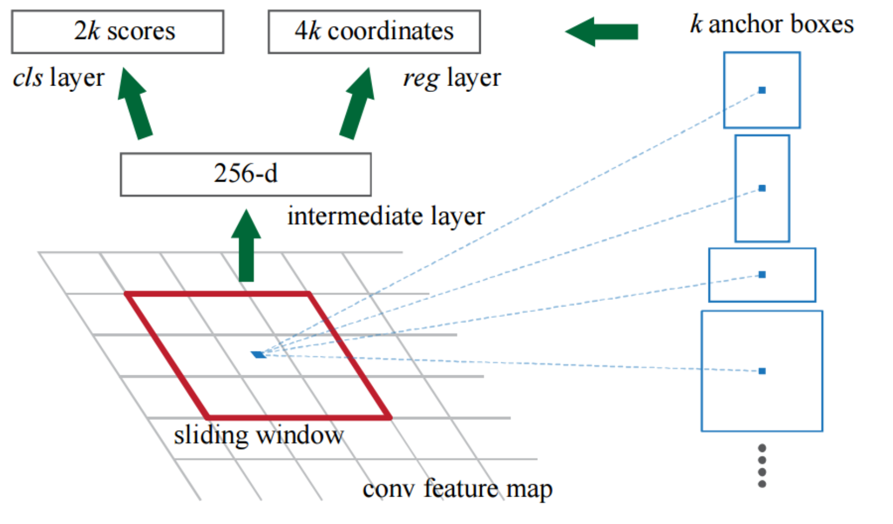
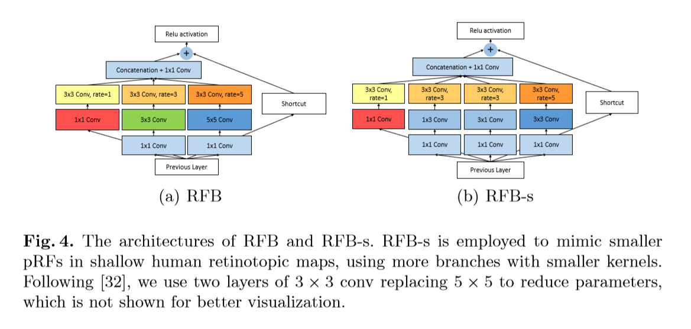
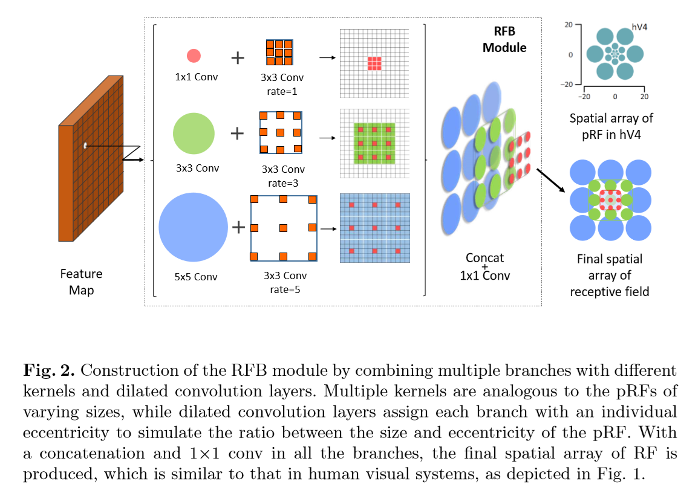
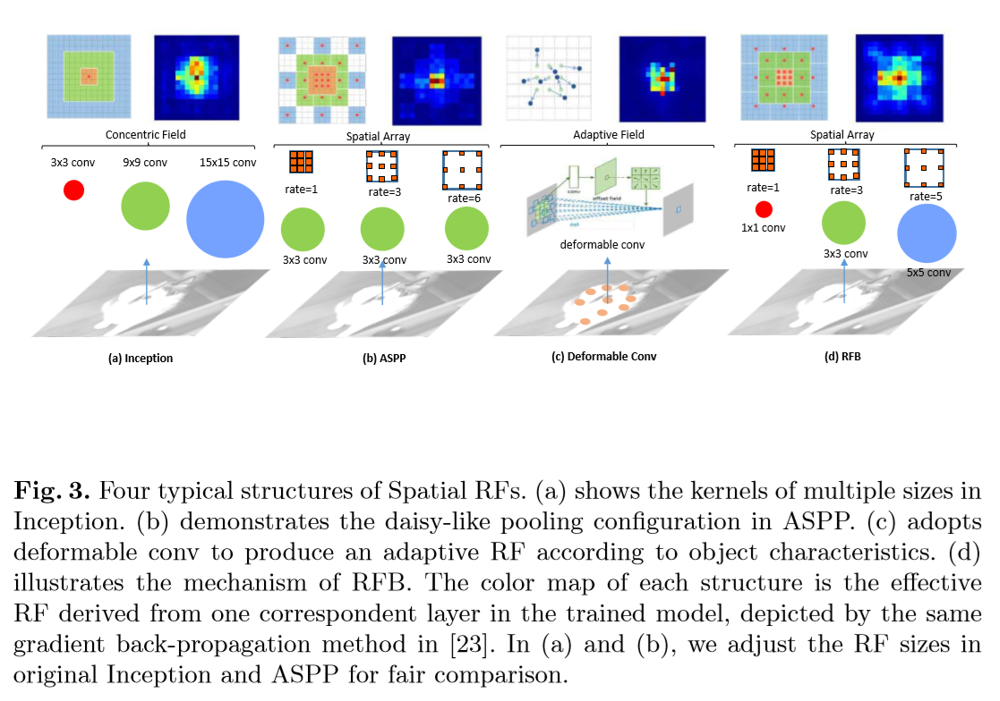

## Two-Stage


### R-CNN


**:star2:HighLight :**

1. 使用CNN队Region Poposals 计算feature vectors。从经验驱动特征（HOG，SIFT）到数据驱动特征（CNN feature Map），提高特征对样本的表示能力。

:exclamation::exclamation:**Bounding Box Regression:**

1. 对于一般窗口使用四维向量 $(x,y,w,h)$ 分别代表中心坐标和长宽。
2. 给定anchor A = $(A_x, A_y, A_w, A_h)$ 和 GT = $(G_x, G_y,G_w, G_h)$ 
3. 寻找一种变换 **F**, 使得：$F(A_x, A_y, A_w, A_h) = (\hat{G_x}, \hat{G_y},\hat{G_w}, \hat{G_h})$，其中$(\hat{G_x}, \hat{G_y},\hat{G_w}, \hat{G_h}) \approx (G_x, G_y,G_w, G_h)$
4. 其中 **F** 为L1 loss，线性回归

**R-CNN Pipeline**

1. pre-train neural network
2. 重新训练全连接层。
3. 提取proposals并计算CNN特征。利用selective search算法提取所有proposals，调整大小（wrap），满足CNN输入，然后将feature map保存本地磁盘
4. 训练SVM。利用feature map训练SVM来对目标和背景进行分类（每个类一个二分类SVM）
5. 边界框回归。训练将输出校正因子的线性回归分类器


---

### Fast R-CNN (ICCV 2015)

```pseudocode
feature_maps = process(image)
ROIs = selective_search(feature_maps)		#expensive!
for ROI in ROIs:
		patch = roi_pooling(feature_maps, ROI)
		class_scores, box = detector(patch)  						
		class_probabilities = softmax(class_scores)
```


---

### Faster R-CNN (NeurIPS 2015)

```pseudocode
Class RPN():
	def __init__(self):
		RPN_conv = nn.conv2d(in,512,(3,3))
		RPN_cls_score = nn.conv2d(512,2*k,(1,1))
		RPN_bbox_pred = nn.conv2d(512,4*k,(1,1))
		RPN_proposal = _ProposalLayer()
		
	def forward(base_feat,gt_boxes):
		rpn_conv1 = F.relu(RPN_conv(base_feat))
		rpn_cls_score = RPN_cls_score(rpn_conv1)
		rpn_cls_prob = reshape(softmax(reshape(rpn_cls_score)))
		
		rpn_bbox_pred = RPN_bbox_pred(rpn_conv1)
		
		rois = RPN_proposal(rpn_cls_prob,rpn_bbox_pred)
		if training:
			cls_loss = CrossEntropy(rpn_cls_prob, gt_boxes.labels)
			bbox_loss = smooth_l1_loss(rpn_bbox_pred, gt_boxes.targets)
		return rois, cls_loss, bbox_loss

feature_maps = process(image)
ROIs = RPN(feature_maps)
for ROI in ROIs:
		patch = roi_pooling(feature_maps, ROI)
		class_scores, box = detector(patch)  			
		class_probabilities = softmax(class_scores)
```


 **背景:**

- Fast R-CNN已经近似实时计算，可是其中的selective search依旧占据了主要的计算时间。

:star2:**HighLight:**  

- 利用RPN代替最后一层的selective search

- <span id="rpn">**RPN:**</span>

  

  1. 在最后一层Feature map上滑动一个3x3的卷积核提取特征至channel=256

  2. RPN对特征图每个像素做k次运算 (k为Anchor Boxes数量，paper中stride=16，caffe输入800x600，feature map 50x38，一共50x38x9=17100个anchor)
  3. 然后经过1x1 conv，分别通过**softmax**和**L1 regression**输出2xk个得分(前景得分，背景得分)和4xk个坐标



**RPN存在问题:**

1. 最小的Anchor尺度是128x128，而coco的小目标很多且尺度远小于这个。为了侦测到小目标，Faster-RCNN不得不放大输入image size，导致计算量增加，而同时大目标可能超过最大的anchor尺度（512x512）
2. 最大的anchor是512x512，而预测层感受野仅为228。一般来说，感受野一定要大于anchor大小
3. 小目标的anchor太少太稀疏，大目标的anchor太多太密集，造成计算冗余。需要忽略跨界边框才能使得模型收敛。

**ROI Pooling**:

- 输入:

  1. **特征图（feature map）**，指的是上面所示的特征图，在Fast RCNN中，它位于RoI Pooling之前，在Faster RCNN中，它是与RPN共享那个特征图，通常我们常常称之为“share_conv”；
  2. **RoIs**，其表示所有RoI的Nx5的矩阵。其中N表示RoI的数量，第一列表示图像index，其余四列表示其余的左上角和右下角坐标。

- 具体操作:

  1. 根据输入image，将ROI映射到feature map对应位置

     注:映射规则比较简单，就是把各个坐标除以“**输入图片与feature map的大小的比值**”，得到了feature map上的box坐标**(一次量化)**

  2. 将映射后的区域划分为相同大小的sections（sections数量与输出的维度相同，**二次量化**）

     - **不能整除时取整**

  3. 对每个sections进行**max pooling**操作

- 输出:

  - 输出是batch个vector，其中**batch**的值等于**RoI**的**个数**，vector的大小为channel (w x h)；RoI Pooling的过程就是将一个个大小不同的box矩形框，都映射成大小固定（w x h）的矩形框。

- 缺点:

  - 两次量化:第一次在确定ROI边界框，第二次在将边界框划分成输出维度个数的sections。


**ROI Alignment**:

- 输入:同ROI Pooling

- 具体操作:
  1. 根据输入image，将ROI映射到feature map对应位置。该步骤取消量化操作，使用**双线性内插**的方法获得**坐标为浮点数的像素点上的图像数值**,从而将整个特征聚集过程转化为一个连续的操作
  2. 将映射后的区域划分为相同大小的sections，继续使用双线性插值获取**浮点数坐标位置的图像数值**
  3. 在每个section中计算固定四个坐标位置，用双线性内插的方法计算出这四个位置的图像数值，然后进行最大池化操作。
  
- 输出:同ROI Pooling

  

**Faster-RCNN Training Pipeline:**


---

### R-FCN: Region based Fully Convolutional Network (NeurIPS 2016)

```python
feature_maps = process(image)
ROIs = region_proposal(feature_maps)
score_maps = compute_score_map(feature_maps)
for ROI in ROIs:
    V = region_roi_pool(score_maps, ROI)
    class_scores, box = averge(V)                 #much simple!
    class_probabilities = softmax(class_scores)
```


**Structure：**


**HighLight :**

1. 在最后一层的feature map上做卷积运算，channel为  。与之**平行的还有一个RPN分支**生成ROIs

   

2.  为每一个class的position score map，一共`C+1` 个类别包括背景

3. 之后通过position sensitive ROI Pooling，为每一个ROI生成相对应Score

**Position-sensitive score maps & Position-sensitive RoI pooling：**

- 将ROI分隔成 bins，如果ROI大小为，则每个bins约为
- Pooling对于第(I, J)个bin的操作，c为第c-th个class：

是其中的一个通道，是一个里数量

- 作用于entire images，区别于之前的ROI只作用在ROI区域。


---

### Feature Pyramid Network for Object Detection (CVPR 2017)

**背景:**

- 网络深度(感受野)与stride通常矛盾，常用的网络下采样stride通常比较大(32)，造成小物体无法在最后一层receptive field内感知到。
- 传统解决方法：
  1. 多尺度训练，Image Pyramid
  2. 特征分层，每层分别预测对应scale分辨率的结果。如SSD
- 多尺度检测面临问题：
  1. 如何学习具有强语义信息的多尺度特征表示？
  2. 如何设计通用的特征表示来解决物体检测的多个子问题？如object proposal，box localization，instance segmentation
  3. 如何高效计算多尺度的特征表示？

**:star2:HighLight：**


- **低层的特征语义信息比较少，但是目标位置准确；高层的特征语义信息比较丰富，但是目标位置比较粗略。另外虽然也有些算法采用多尺度特征融合的方式，但是一般是采用融合后的特征做预测，而本文不一样的地方在于预测是在不同特征层独立进行的。**

1. Bottom-up pathway and Top-down pathway: Top-down 是上采样的一个过程
2. FPN for RPN：将single-scale feature map替换成FPN(multi-scale feature)，代替原来只在最后一层C5滑动卷积核

**四种类似结构:**


1. 图像金字塔，将图像做成不同scale并提取其对应scale的特征
2. 类似SPP net，Fast/Faster RCNN，采用最后一层特征
3. 类似SSD，从不同特征层抽取做独立预测，不增加额外计算量
4. FPN，通过上采样和低层特征融合，每层独立预测。相同大小feature map归为同一个stage

**:star:Structure：**


FPN+RPN


**Results:**

- FPN**(c)**对比原来取自**conv4**， **conv5** 的网络**(a)(b)**，Recall大大提升，特别是在**小物体**上
- 对比实验**(d)**表示在没有top-down，只保留横向连接时(SSD)，效果与RPN差不多
- **(e)** 表示没有横向连接，只有top-down结构时，效果比原来更差
- 综上，**(f)**表示FPN中的横向连接和top-down模式都起到了很大作用


---

###  Scale-Aware Trident Networks for Object Detection (ICCV 2019)

**:star2:HighLight :**

1. Scale-specific feature maps by using deformable Conv
2. Scale-aware training：在BP时忽略不在范围内的bbox
3. tridentnet block的weight是**共享**的

**:star:Structure：**


- **Multi-branch Block:**
  1. Share the same parameters with different dilation rates to generate scale-specific feature maps.
  2. 通常只在last stage替换，因为**large strides lead to larger difference in receptive fields**

- **Scale-aware Training:**

  1. 在训练时，我们只使用corresponding范围内的scales。

  $$
  Lowerbound_i \le \sqrt{wh} \le Upperbound_i
  $$

  2. 可以应用在RPN和R-CNN

- **Inference and Approximation:**

  1. Using NMS and soft-NMS to combine the detection output of multiple branches
  2. 可以选择一个branch来infer

**Ablation Studies：**

1. 性能


2. Inference Trick: enlarge major branch Scale-aware ranges can get higher AP without adding any calculation


3. FPN Comparison


4. Detector Comparison


---

### CBNet: A Novel Composite Backbone Network Architecture for Object Detection 

**Abstract**

- 为了构建更加强壮的backbone，我们提出了一种模型组合的方法
- 可以非常简便的应用在现有的detector上应用


**不同的组合方式及结果**


---

### Cascade R-CNN: Delving into High Quality Object Detection (CVPR2018)

**Abstract**

- 使用低的IOU阈值训练，会让模型产生带有噪音的预测；使用高阈值训练会导致模型效果差
- 导致上述情况的两个原因：
  1. 在训练的时候过拟合，导致成几何增长的positive samples消失
  2. 推理的时候detector的最优解和假设输入的IOUs不一致
- 我们提出Cascade R-CNN来解决上述问题。通过一系列级联的detector，前一个detector为后一个更高精度detector提供更好的输入支持。

---

---

## One-Stage


### SSD: Single Shot Multibox Detector

```pseudocode
levels = process(image)
result = []
for feature_maps in levels:
		class_scores, box = detector(feature_maps)
		result.append([class_scores, box])  
```

**:star2:HighLight :**


1. Default Boxes：

   1. 与Fast-RCNN中Anchor相似，不同的是SSD在多个特征层上面取Default Boxes。
   2. Default Boxes中包含location (绝对坐标)，对每个类别的confidence**包括背景**(假设c个类)。所以每个bbox需要预测4+c个值
   3. Default Boxes长宽比一般为{1,2,3,1/2,1/3}中选取
   4. 输入为图片 300x300， 在conv4_3, conv7,conv8_2, conv9_2, conv10_2, conv11_2分别提取4,6,6,6,4,4个default boxes。由于以上特征图的大小分别是38x38, 19x19, 10x10, 5x5, 3x3, 1x1，所以一共得到38x38x4(小anchor)+19x19x6+10x10x6+5x5x6(中anchor)+ 3x3x4+1x1x4(大anchor)=8732个default box.对一张300x300的图片输入网络将会针对这8732个default box预测8732个边界框。

   

**:star:Structure：**


**Training:**

1. **Default box matching**
  
   - 每个ground truth找与其最大IOU的default box并与之匹配。保证每一个ground truth一定与某个default box匹配。由于ground truth非常少，default boxes非常多，所以设置阈值，使IOU大于阈值的剩余的default box与之匹配。意味着一个ground truth可以匹配多个default box
2. **Hard Negative Mining:**
  
- 因为正负样本差异巨大，我们选择将负样本按照confident score排序，选取置信度最小的default box来train，正负比达到1:3。能够有效提升收敛的效率
  
3. **Loss Function:** `Loss = L_confidence + L_location`

   - N为bounding box数量。前一项为Bounding box与目标的confidence，后一项为相应的回归位置

   - 回归采用**L1-smooth Loss**，confident loss是典型的softmax loss
   - 预测值并非直接通过预测得到的，是通过真实预测值转换得到。真实值为offset，目的是为了获得更好的收敛效果。

   

   

**Inference:**

1. 对于每个预测框，首先根据confidence确定class，再过滤掉IOU小于阈值的预测框

2. 对于剩下的预测框进行解码然后根据confidence排序，保留top-k个预测框

3. 最后用NMS过滤得到结果

**Conclusion:**

- One trick of detecting small object is **Random Crop** operation which can be thought as a "zoom in" operation.
- Multi-scale cone bounding box outputs attached to multiple feature maps at the top of the network
- **SSD300 (input size 300x300).  SSD512 (input size 512x512)**
- Future work: using **RNN** to detect and track objects in video simultaneously
- **小尺度物体检测效果差**
  - 因为 `conv4_3` 具有大feature map但是语意信息不够，导致无法区分**物体和背景** 
  - 物体尺寸比率默认设置 `0.1～0.8`，小物体比例太大

**关于Anchor的问题:**

1. anchor没有设置感受野对齐，对大目标IOU变化不大，对小目标IOU变化剧烈，尤其是感受野不够大时候，anchor有可能偏移出感受野区域，影响性能。
2. anchor必须人工给定，**尺度和比例必须覆盖相应的任务可能出现的所有目标。**


---

### You Only Look Once: Unified, Real-Time Object Detection (CVPR 2016)

```pseudocode
feature_vector = process(image)
feature_tensor = up_sampling(feature_vector)
for grid in feature_tensor:
		class_scores, box = detector(grid)
box_clean = NMS(box)
```


#### v1

**Bounding boxes Design:**

- $x,y,w,h$ (相对坐标；相对于所属边框的x，y；相对于原始图像的w，h比例) And $ confidence$ , $confidence = Pr(Object)*IOU^{truth}_{pred}$，$Pr(Object)$ 为0或1代表存在object or not **(离散值)**
- 每个格子输出B个bboxes信息，以及C个class中属于某个类别的概率
- 总共预测 $ S \times S \times (B * 5 + C)$ tensor，S为长宽grid数量，B为每个grid预测bounding boxes数量，C为class的总数


**Network Design:**

- 先使用CNN提取feature vector，再将fecture vector升为至`k x k x n` tensor，对每个`1 x 1 x n` 的tensor进行loss计算


- 24 Layers Convolutional layers followed by 2 fc layers
- training method：pretrain conv on imagenet dataset

**Loss：**

- 使用均方差MSE，即网络输出$ S \times S \times (B * 5 + C)$ 维向量和GT对应的$ S \times S \times (B * 5 + C)$ 均方差
- 每个格子的Loss：`center_MSE + scale_MSE + object_MSE + noobject_MSE + class_MSE` 一共5项


**Limitation：**

- 每个grid cell只能预测一个class，对临近物体或者小物体的侦测有影响。若两个中心点落入同一个格子，则选取IOU大的一个物体作为预测输出。
- 对长宽比异常的物体侦测有难度（unusual ratios and configurations）
- 大小bounding boxes的errors贡献一致，可是小的error对小的bounding box的IOU影响巨大，会最终导致定位错误

#### V2

**改进:**


**Convolution with anchor box:**

- 摒弃FC layer，FC导致空间信息丢失
- 使用avg代替Flatten，舍弃部分池化层以换取更高的分辨率，输入分辨率为416，下采样总步长32，最终特征图为 13 x 13

**Dimension Clustering:**

- 舍弃原本的**人工筛选**anchor box尺度方法

- 对训练集做kmeans聚类获取5个聚类中心，作为anchor box的设置。

**Direct Location Prediction:**

- 使用相对坐标，不同于faster RCNN。该坐标具有网格进行约束，模型的更稳定，减少训练时间。


**Fine grained Feature(细粒度feature提取):**

1. YOLOv2提取Darknet-19最后一个max pool层的输入，得到26x26x512的特征图。
2. 经过1x1x64的卷积以降低特征图的维度，得到26x26x64的特征图，然后经过**pass through层**的处理变成13x13x256的特征图（**抽取原特征图每个2x2的局部区域组成新的channel**，即原特征图大小降低4倍，channel增加4倍）
3. 再与13x13x1024大小的特征图连接，变成13x13x1280的特征图，最后在这些特征图上做预测。使用Fine-Grained Features，YOLOv2的性能提升了1%.

#### V3


- **route layer:** 指向前面某一层，用来concat

**改进:**

1. 新网络结构：DarkNet-53（更深的网络，残差模型），
2. 融合FPN（多尺度预测），在最后三层是用FPN得出的feature maps作为特征层
3. 用**逻辑回归**替代softmax作为分类器，因为softmax并没有对结果有提升
4. YOLOv3Loss:`ojbect_sigmoid + center_sigmoid + scale_L1 + class_sigmoid`

**:star:Structure:**


**FPN多尺度提取:**

- 在最后3个stage中提取feature map，大小分别为32x32，16x16，8x8

**模型效果:** MS COCO


**Things didn’t work:**

1. **Anchor box $x,y$ offset prediction**
2. **Linear $x,y$ prediction instead of logistic**
3. **Focal Loss**

#### V3 Gaussian

**Loss Function:**
$$
L_x = -\sum_{i=1}^W\sum_{j=1}^H\sum_{k=1}^K \gamma_{ijk}\log(N(x_{ijk}^G|\mu_{t_x}(x_{ijk}))), \sum_{t_x}(x_{ijk})+\varepsilon), \\
x \sim N(\mu, \sigma^2) \ \ \ \ f(x)=\frac{1}{\sqrt{2\pi}\sigma}\exp(-\frac{(x-\mu)^2}{2\sigma^2})
$$
**背景:**

- 由于YOLOv3输出的结果目标类别有概率值，但是**目标框只有位置没有概率值**，目标框的输出是一个已经由模型输出的参数，但是其 $x,y,w,h$ 的可靠性无法预知。本文提出利用Gaussian模型来对网络输出进行建模，基本不改变YOLOv3的结构和计算量下，能够更加refine每一个输出的bboxes，性能总体比YOLOv3提升3个点mAP

**Bounding box regression branch:**


- 从输出预测4个维度$(x,y,w,h)$ 增至8个维度 (均值和方差)

- Gaussian YOLOv3预测每个坐标的不确定性，从而提升最终prob值的精确性
  $$
  u_{aver} = \frac{(tx + ty + tw + th )}{4.0} \\
  Confidence_{Gaussian} = IOU \times Prob_{obj} \times (1.0 - u_{aver})
  $$

**Result:**


---

### Focal Loss for Dense Object Detection (ICCV 2017)


**背景:**

1. Single Stage Detector之所以识别率低是因为class imbalance。负样本数量远远大于正样本。

2. Negative sample数量过多导致贡献的Loss淹没了positive的Loss，即分类器将它全部分为负样本的准确率虽然高，但是召回率低。
3. 大多数训练样本为**easy negative**，非常容易被区分的背景类，单个样本loss非常小，反向计算时梯度非常小，**对收敛作用非常小**。我们需要的是hard positive/negative的大loss来促进收敛。
4. **OHEM：** 对loss排序，筛选最大的loss来进行训练。保证每次训练都是hard example

**四类example:** hard positive、hard negative、easy positive、easy negative


**Focal Loss**:
$$
CE(p_t)=\begin{cases}
-\alpha_t \log(p_t) &{,if \ \ \ y=1}\\
-(1-\alpha_t) \log(1-p_t) &{,if \ \ \ y=0}
\end{cases}
$$

- 上式解决**正负**样本不平衡问题

$$
FL(p_t)=\begin{cases}
-(1-p_t)^\gamma \log(p_t) &{,if \ \ \ y=1}\\
-p_t^\gamma \log(1-p_t) &{,if \ \ \ y=0}
\end{cases}
$$

- 上式解决**难易**样本不平衡问题

$$
FL(p_t)=\begin{cases}
-\alpha_t(1-p_t)^\gamma \log(p_t) &{,if \ \ \ y=1}\\
-(1-\alpha_t)p_t^\gamma \log(1-p_t) &{,if \ \ \ y=0}
\end{cases}
$$

- 上式同时解决以上两个问题 — **Focal Loss**

1. 无论是前景类还是背景类，$p_t$ (概率)越大，权重$(1-p_t)^\gamma$就越小。也就是说easy example可以通过权重进行抑制；
2. $\alpha_t$ 用于调节positive和negative的比例，前景类别使用 $\alpha_t$ 时，对应的背景类别使用 $1-\alpha_t$ ；
3. $\gamma$ 和 $\alpha_t$ 的最优值是相互影响的，所以在评估准确度时需要把两者组合起来调节。作者在论文中给出$\gamma=2$ $\alpha_t = 0.25$ 时，ResNet-101+FPN作为backbone的结构有最优的性能。

**RetinaNet结构:**


- **Can be seen as SSD+FPN** :exclamation:


---

### Receptive Field Block Net for Accurate and Fast Object Detection (ECCV 2018)

**:star2:HighLight :**

1. 模拟人类视觉的感受野加强网络的特征提取能力，RFB利用空洞卷机模拟复现人眼**pRF尺寸和偏心率**之间的关系。**卷积核大小和膨胀率与pRF尺寸和偏心率有着正比例关系**。
2. 借助了split-transform-merge的思想，在Inception的基础上加入了dilated conv，增大了感受野
3. 整体**基于SSD**进行改进，速度快而且精度高（VGG的精度能与two-stage ResNet 精度相提并论）

**Receptive Field Blocks：**



- 左:在第一层卷积层后面增加dilated conv，最后concate之后过一个1x1 Conv

- 右:**使用1x3 和 3x1的kernel替代 3x3 conv**，减少参数。**使用两个3x3 conv替代5x5 conv**，图中没有显示出来是为了更好的visualization



**模型:**


1. 将SSD主干网络中conv8，conv9替代为RFB
2. 将conv4_3，conv7_fc后分别接入RFB-s和RFB结构

**模型对比:**



- Inception：单纯的用不同size的conv 并将Feature map concate。感受野从中心发散，**没有偏心率的体现**
- ASPP：将不同rate的dilated conv叠加，感受夜中心发散，可是感受范围小。**pRF尺寸过小**
- Deformable：使用偏置项使conv能够解决空间一致性的问题，RF能够自适应object特征
- RFB：使用dilated卷积，平衡了a，b两者的优点。


---

### Pooling Pyramid Network for Object Detection (SSD改进)

**:star:Structure：**

- shared tower：输入为19×19, 10×10, 5×5, 3×3, 2×2, and 1×1的feature map通过1x1x512 卷积核
- 训练:
  - L1-smooth for box regression
  
  
  
  - Focal Loss $\alpha = 0.25 $ , $\gamma = 2$

**:star2:HighLight :**

- **使用max pooling构建feature pyramid** 代替conv特征提取。更快，共享embedding space
- 将多个box detector减少至一个，避免了跨尺度的分类器的分数错误校准
- 与SSD效果相同，但是size小3倍


**疑问:**

1. shared tower怎么操作不同尺寸的feature map


---

### Feature Selective Anchor-Free Module for Single-Shot Object Detection (CVPR 2019)

:star:**Structure**:


- 内含anchor-based和anchor-free模块（A为anchor个数，K为class num）

监督训练信号（supervision signal）:


1. ground truth box：k
2. ground truth box 坐标:$b = [x,y,w,h]$
3. ground truth box 在第$l$层上的投影:$b_p^l=[x_p^l,y_p^l,w_p^l,h_p^l]$
4. effective box：$b_e^l=[x_e^l,y_e^l,w_e^l,h_e^l]$，他表示$b_p^l$的一部分，缩放系数比例 $\epsilon_e = 0.2$
5. ignoring box：$b_i^l=[x_i^l,y_i^l,w_i^l,h_i^l]$ ，他表示$b_p^l$的一部分，缩放系数比例 $\epsilon_i = 0.5$

- Classification Output

  - effective box 表示positive区域，如图白色部分所示。$b_i^l - b_e^l$ 这个部分ignoring区域不参与分类任务，如图灰色部分所示。剩余黑色部分为negative。分类任务是对每个像素做分类，考虑到正负样本不均衡，采用Focal Loss

- Box Regression Output

  - 输出4个offset map。这里取的是像素（i，j）与$b_p^l$ 四个边框的距离。gt bbox 只影响了$b_e^l$区域，所以这里（i，j）是该区域的所有像素。回归分支采用的是IOU Loss

    

- Online Feature Selection

  
  
  1. 实例输入到金字塔所有层，求得IOU loss和focal loss的和
  2. 选取loss和最小的层来学习实例得到feature map
  3. 训练时，特征根据安排的实例进行更新。
  4. 推理时，不需要进行特征更新，因为最适合学习的金字塔层自然输出最高置信分数。


---

### <span id="keyp">Object as Points (Center Net) </span>

**特点:**

1. anchor 仅基于位置，而不是IOU

   

2. 无需进行NMS操作，每个object只有一个positive anchor (from local peak in the keypoints heatmap)

3. 输出的是大分辨率的图像来与原图做对比 (stride = 4)

**Result:**


---

### RepPoints

---

### Enriched Feature Guided Refinement Network for Object Detection (ICCV 2019)

**Abstract**

- Single-stage det framework that jointly tackles multi-scale object detection and classes imbalanced
- Cascaded refinement scheme instills multi-scale contextual features into the prediction layers of the single-stage detector to enrich their discriminative power for multi-scale detection 
- Cascaded refinement scheme counters the class imbalance problem by refining the anchors and enriched features to improve classification and regression

**Contribution**

1. Instill the multi-scale contextual features into the SSD prediction layers in a bottom-up pyramidal feature hierarchy. The resulting enriched features are more robust to scale variations
2. It address the class-imbalance problem by utilising the enriched features to perform class-agnostic classification and box regression for accurate localisation.
3. The init box regression and the binary classification are further utilised to refine the associated enriched features for obtaining final classification scores and bbox regression

**Architecture**


**Multi-scale Contextual Features Module**

1.  Pass through two consecutive conv layers 3x3 and 1x1, resulting in init projection
2. Projections are sliced into three low-dim branches through a 1x1 conv layer to capture multi-scale contextual info with **dilation rates 1, 2, 4**.
3. These transform features aggregated through a concatenation op and pass to 1x1 conv for channel up-sampling

**Objectness Module**

1. enriched feature are used to perform a binary classification ($C_{1x}$) and initial bbox reg ($B_{1x}$) 该模块相当于two-stage的第一个stage的作用

2. 使用multi-scale contextual infomation能够更加注重局部目标，通过了binary classification能够进一步过滤掉无用背景框，帮助SSD更好的回归

   

**Feature Guided Refinement Module**

1. Objectness Map Generation: max-pooling + sigmoid = $O_{1x}$,  $F_m = F_{in} \bigodot O_{1x} + F_{in}$ 

2. Kernel Offsets Extraction: FGRM modules predict 4 outputs: x,y,w,h. X,y, is 空间offset，w,h, is尺度offset。使用spatial offset作为deform conv的初始偏置
3. Local contextual information：

---

### EfficientDet: Scalable and Efficient Object Detection 

**Abstract**

- Propose a weighted bi-directional feature pyramid network **(BiFPN)**
- Propose a **compound scaling method** that uniformly scale the resolution, depth and width for all backbone, feature network, and box/class prediction networks at the same time
- More accurate, 4x smaller and 9.3x fewer FLOPs

**BiFPN**


- PANet achieves better accuracy than FPN and NAS-FPN, but with the cost of more parameters and computations
- Weighted Feature Fusion: 通过计算得到每一层feature weight的最优值，再将它们叠加起来

**EfficientDet Architecture**


---

---

## Training Methods

### An Analysis of Scale Invariance in Object Detection - SNIP (CVPR 2018)

### SNIPER: Efficient Multi-Scale Training (NeurIPS 2018)

**:star2:HighLight  :star2:**

- Scale Normalization Image Pyramid Efficient Resampling
- 融合了**RCNN**的Scale Invariant和**Fast-RCNN**的速度
- 解决了**image pyramid**在缩放原图时造成大object更大，小object更小的问题(Fast-RCNN中使用到)
- 使用低分辨率chips全覆盖所有object，减少计算量

**Chips：**

```markdown
1. Context-region(chips) 会在不同比例上的图片以等间隔(d=32)的形似生成，大小固定为`K x K`

2. 与anchor操作相反，anchor是改变自身的size来迎合feature map中的gt

3. 训练的是chips而不是原图，每个chips都包含了若干个目标
```

- **Positive Chips：**

  1. 每个scale的chips都有area range $R^i = [r_{min}^i, r_{max}^I], \ i\in [1,n]$，这个scale上的gt boxes用来训练，其余无效

     

  2. 在不同scale上截取相同大小chips，方式接近RCNN。对于较小目标相当于zoom in；对于大目标相当于zoom out；对于网络来说，输入还是固定大小chips。

- **Negative Chips：**

  1. 由于上述positive chips不包含背景，导致false positive rate比较高。因此需要negative chips来提高网络对背景的分类
  2. 使用精度不高的RPN生成一系列proposal，将被positive chips覆盖的proposals去掉。其余的在每个scale上选取若干个在 $R^{i}$ 范围内的proposal的Owner Chip作为Negative Chips


---

### Soft-NMS (ICCV 2017)


**Reasons:**

1. 无法检测overlap比较高的同类物体，导致低recall

**Improvement:** 

- Old: 将IOU大于阈值的窗口的得分全部置0

- New: 将大于阈值的窗口得分做衰减	

  - 线性衰减

  $$
  S_i = \begin{cases}
  S_i& {iou(M,b_i)<N_t}\\
  S_i(1-iou(M,b_i))& {iou(M,b_i) \ge N_t}
  \end{cases}
  $$

  - 高斯加权

  $$
  S_i = \begin{cases}
  S_i& {iou(M,b_i)<N_t}\\
  S_ie^{-\frac{iou(M,b_i)^2}{\sigma}}& {iou(M,b_i) \ge N_t}
  \end{cases}
  $$


---

#### Generalized-IoU (CVPR 2019)

```pseudocode
input :Two arbitrary convex shapes: A,B ⊆ S ∈ R
output :GIoU

1. For A and B, find the smallest enclosing convex object C, where C ⊆ S ∈ R
2. IoU = |A ∩ B| / |A ∪ B|
3. GIoU = IoU - ｜C/（A ∪ B）｜ / ｜C｜  # 当A与B越来越远，（A ∪ B）会越来越小。所以｜C/（A ∪ B）｜会
																				 趋向于｜C｜,右边的比值会接近1.GIoU的最小值会无限接近于1
```

- Lower bound for IoU


---

#### Distance-IoU Loss

**Abstract**

- GIoU and IoU在predicted box包含gt的时候无法正确反映出Loss的情况


- GIoU通常会增大predicted box来缩小Loss_GIoU以达到收敛的目的


- DIoU通过中心点距离和长宽比信息能够更有效提升效果和加速收敛，获得的predicted box更加贴合gt

- DIoU能够整合进NMS里面作为辅助代替IoU

**DIoU**

1. 其中d是两个中心点的欧式距离
2. C是两个box最小封闭矩形的斜边长

$$
DIoU = IoU -\frac{d}{c^2}
$$


---

---

## Evaluation Metrics


---

---

## Deep Object Detection Survey

### Selective Search

```pseudocode
Create ROI
while ROI can merge:
	calculate pixel info
	merge two pixel if they are similar
return ROI
```


### [Anchor Based - RPN](#rpn)

### [Key-Point Based](#keyp)

### How Anchor affect the regression

- **Question: 为什么需要用anchor去回归？使用随机参数回归，最后也应该能到GT，只不过收敛速度不一样。Anchor是如何影响预测框形状的？**

- **Answer**: 

  - 基于anchor的方法目的是**学习一个从anchor box到gt box的转换函数**，而不是将anchor box拿去回归

  - 在parameterize过程中，使用anchor的宽高约束，让loss更加合理

  - Maths:

    **从候选框P回归到GT的变换过程**
    $$
    \hat{G_x} = P_wd_x(P)+P_x \\
    \hat{G_y} = P_hd_y(P)+P_y \\
    \hat{G_w} = P_w\exp(d_w(P)) \\ 
    \hat{G_h} = P_h\exp(d_h(P))
    $$
    

    **回归目标 $t_*$ 的计算**
    $$
    t_x = \frac{(G_x - P_x)}{P_w} \\
    t_y = \frac{(G_y - P_y)}{P_h} \\
    t_w = \log({\frac{G_w}{P_w}}) \\
    t_h = \log({\frac{G_h}{P_h}}) \\
    $$
    **Using Ridge Regression in box reg**
    $$
    d_*(P) = w^T_* \phi_5(P), \ where \ w_* \ is \ learnable \\
    w_* = \mathop{argmin}_\hat{w_*}\sum_i^N(t_*^i-\hat{w_x^T\phi_5(P^i)})^2+\lambda||\hat{w_*}||^2
    $$
    

## Imbalance Problems in Object detection

1. 类别不平衡：前景和背景不平衡、前景中不同类别输入包围框的个数不平衡；

2. 尺度不平衡：输入图像和包围框的尺度不平衡，不同特征层对最终结果贡献不平衡；

3. 空间不平衡：不同样本对回归损失的贡献不平衡、正样本IoU分布不平衡、目标在图像中的位置不平衡；

4. 目标函数不平衡：不同任务（比如回归和分类）对全局损失的贡献不平衡。


**Example of Imbalance problems**


**Problems Based**


**Solution Based**


**Toy Example of Selection methods**


## Referenece

- [从RCNN到SSD，这应该是最全的一份目标检测算法盘点, 机器之心](https://mp.weixin.qq.com/s?__biz=MzA3MzI4MjgzMw==&mid=2650741534&idx=1&sn=02dc164ffcedbf22124b97841ba67fe5&chksm=871adf60b06d567690fa2328b161c012a464687768e50f812a51b5533a7d68b99af1cf8f02b8&scene=21#wechat_redirect)


