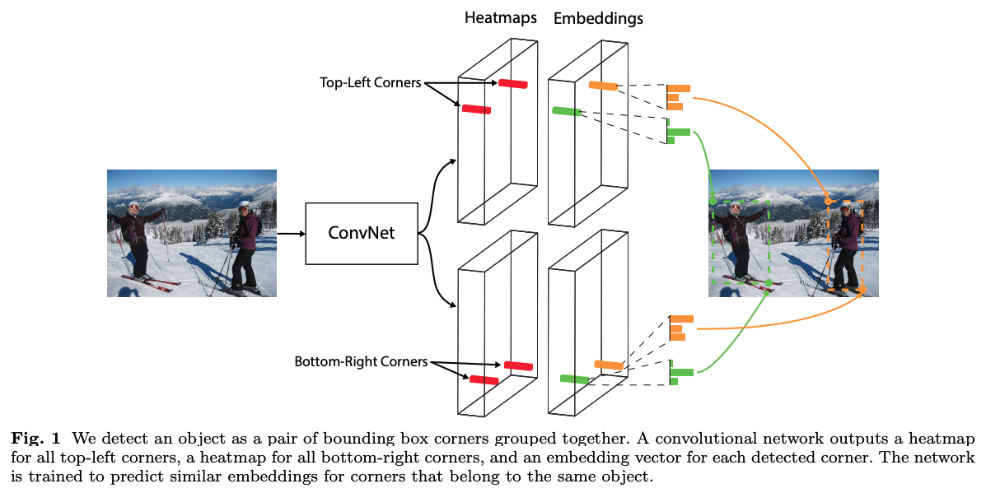

# Deep Object Detection Survey

## Selective Search

```pseudocode
Create ROI
while ROI can merge:
	calculate pixel info
	merge two pixel if they are similar
return ROI
```


## [Anchor Based - RPN](#rpn)

## [Key-Point Based](#keyp)

#### How Anchor affect the regression

- **Question: 为什么需要用anchor去回归？使用随机参数回归，最后也应该能到GT，只不过收敛速度不一样。Anchor是如何影响预测框形状的？**

- **Answer**: 

  - 基于anchor的方法目的是**学习一个从anchor box到gt box的转换函数**，而不是将anchor box拿去回归

  - 在parameterize过程中，使用anchor的宽高约束，让loss更加合理

  - Maths:

    **从候选框P回归到GT的变换过程**
    $$
    \hat{G_x} = P_wd_x(P)+P_x \\
    \hat{G_y} = P_hd_y(P)+P_y \\
    \hat{G_w} = P_w\exp(d_w(P)) \\ 
    \hat{G_h} = P_h\exp(d_h(P))
    $$
    

    **回归目标 $t_*$ 的计算**
    $$
    t_x = \frac{(G_x - P_x)}{P_w} \\
    t_y = \frac{(G_y - P_y)}{P_h} \\
    t_w = \log({\frac{G_w}{P_w}}) \\
    t_h = \log({\frac{G_h}{P_h}}) \\
    $$
    **Using Ridge Regression in box reg**
    $$
    d_*(P) = w^T_* \phi_5(P), \ where \ w_* \ is \ learnable \\
    w_* = \mathop{argmin}_\hat{w_*}\sum_i^N(t_*^i-\hat{w_x^T\phi_5(P^i)})^2+\lambda||\hat{w_*}||^2
    $$
    

## Imbalance Problems in Object detection

1. 类别不平衡：前景和背景不平衡、前景中不同类别输入包围框的个数不平衡；

2. 尺度不平衡：输入图像和包围框的尺度不平衡，不同特征层对最终结果贡献不平衡；

3. 空间不平衡：不同样本对回归损失的贡献不平衡、正样本IoU分布不平衡、目标在图像中的位置不平衡；

4. 目标函数不平衡：不同任务（比如回归和分类）对全局损失的贡献不平衡。


**Example of Imbalance problems**


**Problems Based**


**Solution Based**


**Toy Example of Selection methods**


## Bridging the Gap Between Anchor-based and Anchor-free Detection via Adaptive Training Sample Selection ()

# Anchor Free

## CornerNet: Detecting Objects as Paired Key-points (ECCV 2018)

### **Abstract**

- 提出使用左上，右下角点作为一对关键点确定bbox的网络
- 解决了需要设计anchor boxes的麻烦
- 提出corner pooling帮助网络获取更好的角点，获得42.2% AP 在MS COCO上



### **Network**


- #### **Grouping Coners**

  Embeddings的距离，距离近的一组corner为作用一同一个instance

- #### **Corner Pooling & Prediction Module** 


## Feature Selective Anchor-Free Module for Single-Shot Object Detection (FSAF, CVPR 2019)

### :star:**Structure**:


- 内含anchor-based和anchor-free模块（A为anchor个数，K为class num）

### 监督训练信号（supervision signal）:


1. ground truth box：k
2. ground truth box 坐标:$b = [x,y,w,h]$
3. ground truth box 在第$l$层上的投影:$b_p^l=[x_p^l,y_p^l,w_p^l,h_p^l]$
4. effective box：$b_e^l=[x_e^l,y_e^l,w_e^l,h_e^l]$，他表示$b_p^l$的一部分，缩放系数比例 $\epsilon_e = 0.2$
5. ignoring box：$b_i^l=[x_i^l,y_i^l,w_i^l,h_i^l]$ ，他表示$b_p^l$的一部分，缩放系数比例 $\epsilon_i = 0.5$

- #### Classification Output

  - effective box 表示positive区域，如图白色部分所示。$b_i^l - b_e^l$ 这个部分ignoring区域不参与分类任务，如图灰色部分所示。剩余黑色部分为negative。分类任务是对每个像素做分类，考虑到正负样本不均衡，采用Focal Loss

- #### Box Regression Output

  - 输出4个offset map。这里取的是像素（i，j）与$b_p^l$ 四个边框的距离。gt bbox 只影响了$b_e^l$区域，所以这里（i，j）是该区域的所有像素。回归分支采用的是IOU Loss

    

- #### Online Feature Selection

  

  1. 实例输入到金字塔所有层，求得IOU loss和focal loss的和
  2. 选取loss和最小的层来学习实例得到feature map
  3. 训练时，特征根据安排的实例进行更新。
  4. 推理时，不需要进行特征更新，因为最适合学习的金字塔层自然输出最高置信分数。

## FCOS: Fully Convolutional One-Stage Object Detection

### **Abstract**

- Anchor Free和Proposal Free
- 逐点像素回归预测，多尺度特征和centerness

### **Network**


- #### Output:

  - 80 channel tensor of classification labels on MS COCO
  - 4 channel tensor of `(l, t, r, b)` bboxes coordinates
  - Center-ness: $centerness^*=\sqrt{\frac{min(l^*,r^*)}{max(l^*,r^*)}\times\frac{min(t^*,b^*)}{max(t^*,b^*)}}$ 

  

## <span id="keyp">Object as Points (CenterNet) </span>

### **特点:**

1. anchor 仅基于位置，而不是IOU

   

2. 无需进行NMS操作，每个object只有一个positive anchor (from local peak in the keypoints heatmap)

3. 输出的是大分辨率的图像来与原图做对比 (stride = 4)

### **Network**

- ground truth使用高斯核将关键点分布到特征图上供给模型学习

- Backbone选择Hourglass，有助于预测heatmap

- 3个header分别是类别，长宽，中心偏置。其中每个像素点预测`(1, 80, 128, 128), (1, 2, 128, 128), (1, 2, 128, 128)`
- 采用focal loss训练类别，L1损失训练回归
- $L_{det} = L_k + \lambda_{size}(0.1)L_{size} + \lambda_{off}(1)L_{off}$

### **Inference**

1. 针对一张图像做下采样后进行预测，对每个类的下采样特征图预测中心点
2. 热点提取通过检测当前热点的八邻近点都小于中心点，采集100个热点（使用nn.MaxPool(3x3)达到目的）假设$\hat{P}_c$ 为检测到点， $\hat{P}_c = (\hat{x}_i, \hat{y}_i)^n_{i=1}$
3. 随后，标定框为 $(\hat{x}_i+\delta\hat{x}_i-\hat{w}_i/2, \hat{y}_i+\delta\hat{y}_i-\hat{h}_i/2, \hat{x}_i+\delta\hat{x}_i+\hat{w}_i/2, \hat{y}_i+\delta\hat{y}_i+\hat{h}_i/2)$
4. 最后根据模型预测的中心点存在物体的概率值（heatmap分支），设置阈值0.3，将上面100个热点结果中高于阈值的作为最终结果。

### **Result:**


## Region Proposal by Guided Anchoring

### **Abstract**

- 提出使用图像语义特征来知道anchor的生成
- 性能和速度远超传统RPN，可以直接替换

### **Background**

- Two Stage：anchor —> proposal —> detection bbox
- One Stage: anchor —> detection bbox

### **Motivation**

- 尺度和长宽比需要预设，对性能影响大。也无法满足长宽比特殊的物体
- 过多的anchors影响性能和速度
- 大部分anchor分布在背景区域，对proposal或检测没有任何正面影响
- 希望制作稀疏，形状根据位置可变的anchor

### **Formulation**

- $P(x,y,w,h | I) = p(x,y|I)p(w,h|x,y,I)$
- 从上式可以看出anchor概率分布可以分解为两个条件概率分布，中心点概率分布和形状概率分布
- Sliding Window(RPN)可以看作均匀分布的$p(x,y|I)$和冲击函数$p(w,h|x,y,I)$


1. #### **位置预测**
- 这里并不是预测每个点是前后景，而是预测是否中心点
  
- 设计时距离中心一定范围对应正样本，这样可以筛选出一小部分区域作为anchor的候选中心点，使得anchor数量大大降低。
  
2. #### **形状预测**

   - 使用sample的9组w和h去做与匹配得到和gt IoU最大的anchor，这里发现sample超参并不敏感

3. #### **Feature Adaption**

   - anchor形状信息融入feature map中输出新的特征图，利用3x3 deformable conv来修正原始特征图。offset通过anchor的w和h经过一个1x1 conv得到的。

   - 使feature的有效范围和anchor的形状更加接近

## CornerNet-Lite: Efficient Key-points Based Object Detection 

### **Abstract**

- CornerNet-Saccade提升AP且加快速度

### **Saccade for detection**

- 以顺序或者并行的方式有选择的裁剪和处理图片patch，能有效提升inference速度
- 扫视在R-CNN，Fast R-CNN以及Faster R-CNN的体现是selective search和RPN。在处理后，每个crop image patch会被带上label box继续做分类或者回归或者丢弃。
- Cascade R-CNN在Faster R-CNN的基础上增加了分类起和回归期进一步的筛选增强region proposal
- saccade在R-CNN的变体中处理的都是单类型单目标。然而CornerNet-Saccade中，是单类型多目标。因此，通过CornerNet-Saccade产生的crop数量会比目标数量少很多

### **Network**


1. 在downsized full image通过attention map生成物体的bbox
2. zoom in和crop bbox附近的区域成image patch，然后在image patch上做detect
3. 利用top-k ranking控制生成image patch数量还有NMS避免image patch生成overlap冗余的patch


### **Image Patch处理**


## Rotation Detector

1. OpenCV：角度定义为图像的width和x轴的角度


2. 最长边表示法：角度定义为图像的最长边和x轴的角度


## SCRDet: Towards More Robust Detection for Small, Cluttered and Rotated Objects（ICCV 2019）

### **Abstract**

- 小目标，任意方向，分布密集的目标仍是挑战
- 使用多层融合feature来提高对小目标的感知
- 有监督pixel attention和channel attention能够抑制噪声和更好地感知小而密集的目标
- 使用添加了IoU参数的smooth L1来解决rotation bbox问题


**SF-Net**


- Inception Module用于增加感受野和语义信息

### **Multi-Dimensional Attention Network**


- 有监督注意力机制能够指导网络更好的学习
- Pixel Attention: 使用saliency map+softmax作为像素注意力机制，排除噪声。双通道saliency map代表前景和背景的概率
- Channel Attention：使用SE-module类似的方法，作为通道注意力机制


### **Rotation-Branch**


- Angle: $[\pi/2, 0)$，对齐OpenCV，一边是x轴，另一边是w
- rotation-NMS用来做后处理
- 使用IoU监督smooth-L1 loss回归
  - 

## R2CNN: Rotational Region CNN for Orientation Robust Scene Text Detection		 (CVPR 2017)

### **Abstract**

- Axis-aligned bboxes


## RRPN: Arbitrary-Oriented Scene Text Detection via Rotation Proposals (CVPR 2019)

### **Abstract**

- 提出了RRPN和RROI概念来处理旋转矩形框问题


### **Rotation RPN**


- ground truth：$(x,y,w,h,\theta)$，$x,y$是中心，$w$是长边，$h$是短边，$\theta$为长边旋转角$[\frac{\pi}{4}, \frac{3\pi}{4})$

- 一共3x3x6=54个anchor

- Rotated proposal sampler:

  - 正样本：IoU大于0.7且角度小于等于π/12
  - 负样本：IoU小于0.3或IoU大于0.7但是角度大于π/12
  - 中间样本：不参与训练

- Loss：
  $$
  L(p,l,v^*,v) = L_{cls}(p,l) + \lambda lL_{reg}(v^*,v)
  $$

  - `l` 为class label (l=1为前景；l=0为背景，回归不参与训练)
  - `v` = $(v_x,v_y,v_w,v_h,v_\theta)$ 为预测
  - Lcls使用CE，Lreg使用Smooth L1
  - Default Loss weights: (10,10,5,5,1)
  

### Rotation RoI Pooling

- 仿射变换之后再做RoI Poolin


### Skew NMS

1. keep the max IoU for proposals with an IoU larger than 0.7
2. if all proposals have an IoU in the range [0.3, 0.7], keep the proposal with the minimum angle difference with respect to the ground truth (the angle difference should be less than π/12)

## $R^3$Det: Refined Single-Stage Detector with Feature Refinement for Rotating Object 

## Gliding vertex on the horizontal bounding box for multi-oriented object detection

### **Abstract**

- 提出新的旋转框回归方式，使用horizental box vertex的glide距离和(x,y,w,h)作为监督回归框的参数
- 同时减少相近目标的混淆，引入obliquity factor基于area ratio between target & horizental gt

### **Rotated Box Regression**


# Set Prediction

## End-to-End Object Detection with Transformers


# Few-shot Detection

### General ideas

1. Re-sampling Methods: 

   - Oversampling
     - High potential risk of overfitting
   - Undersampling
     - Infleasible in extreme long-tailed datasets

   - Class-balanced sampling

   - decoupling training schema: first learns the representations and classifier jointly, then obtains a balanced classifier by re-training the classifier with class-balanced sampling

2. Re-weighting Methods: Assign weights for different training samples

   - Online hard example mining

3. Feature Manipulation: 

   - Range loss enlarges inter-classes distance and reduces intra classes variations simultaneously
   - Augments the feature space of tail classes by transferring the feature variance of regular classes that have sufficient training samples

## Few-shot Object Detection via Feature Reweighting

### Abstract

- Meta feature learner和reweighting module within one-stage detector

### Architecture


## Overcoming Classifier Imbalance for Long-tail Object Detection with Balanced Group Softmax (CVPR2020)


### Abstract

- 由于long tail尾部classes的分类的weight norm较小，原因是在训练class j的时候，会提升class j的weight norm，降低others。所以导致tail classes仅有的少量数据训练，weight norm远不及head classes。
- 提出Balanced Group Softmax来缓解目前问题

### Introduction

```markdown
1. Through comprehensive analysis, we reveal the rea- son why existing models perform not well for long-tail detection, i.e. their classifiers are imbalanced and not trained equally well, reflected by the observed imbal- anced classifier weight norms.

2. We propose a simple yet effective balanced group soft- max module to address the problem. It can be easily combined with object detection and instance segmen- tation frameworks to improve their long-tail recogni- tion performance.

3. We conduct extensive evaluations with state-of-the-art long-tail classification methods for object detection. Such benchmarking not only deepens our understand- ings of these methods as well as the unique challenges of long-tail detection, but also provides reliable and strong baselines for future research in this direction.
```

### Long-tail classification

- Re-sampling: 过采样，降采样，类均衡采样。
  - 缺点：多余的训练时间，对tail classes过拟合
- Cost-sensitive：平均每个classes的权重或增大tail classes权重
  - 缺点：参数过多难以调试

### Balanced Group Softmax


#### Group Softmax

#### Calbration via category “others”

## Equalization Loss for Long-Tailed Object Recognition (CVPR 2020)

### Abstract

- 该文中，将positive sample of one category视作另外category的negative sample，使其获得更多的负梯度。
- 提出equalization loss，其能从梯度反向传播与网络更新中保护学习rare categories

### Introduction

先前的工作主要从1. Sampling的方法解决long-tail class的问题。2. loss的方法主要是解决前后景类别不均衡而提出的(focal loss，面临问题是前后景数量差距过大，前景object的classes number分类还是均衡的)，在解决不同前景的长尾数据集（前景object的classes number十分不均衡）中依旧是个难题

我们主要的贡献有

1. 提出创新的角度处理long tail问题：抑制rare categories的之间的竞争，这个导致poor performance的重要原因
2. 在图像识别和图像分割中也做了消融实验证明方法的可行性和鲁棒性

### Equalization Loss

$$
L_{EQL} = -\sum_{j=1}^Cw_j\log(\hat {p_j}) \\
w_j = 1-E(r)T_\lambda(f_j)(1-y_j) \\
TR(\lambda) = \frac{\sum_j^CT_\lambda(f_j)N_j}{\sum_j^CN_j}
$$

1. 对于小于threshold的rare categories忽略作为负样本的抑制梯度更新
2. 不忽略背景图片的梯度更新
