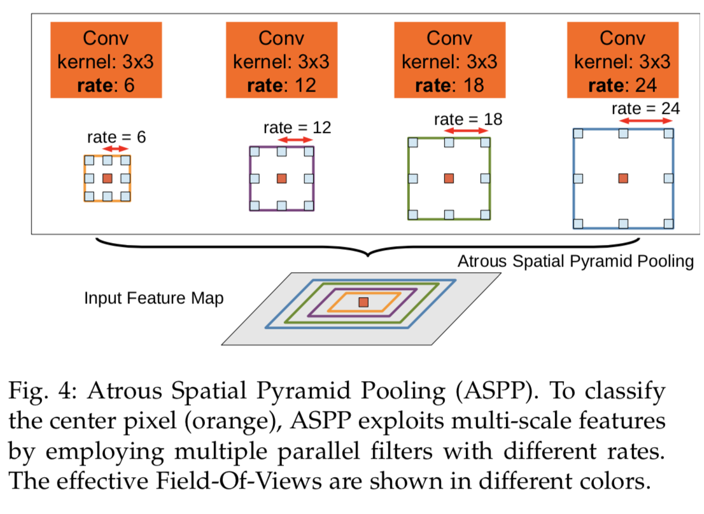

# Object Segmentation Models

## Encoder-Decoder Architecture

- **Encoder**: 探测多尺度语义信息
- **Decoder**: 从空间信息中逐渐恢复并抓取物体边界

# Semantic Segmentation

## Fully Convolutional Networks for Semantic Segmentation (CVPR 2015)

#### 模型特点：

- 采用反卷积对最后一层的feature map进行上采样(up-sampling)使他恢复到与输入相同尺寸，保留了原输入图像的空间信息，最后在up sampling(反卷积 deconvolutional) 的特征图上进行逐帧的像素分类--pixel wise **softmax** prediction (**softmax loss**)。
- 属于语义分割 **(Semantic Segmentation)**

## U-Net: Convolutional Networks for Biomedical Image Segmentation

#### 模型特点：

1. Encoder-Decoder型，对称
2. skip-connection

#### 模型结构：

## V-Net: Fully CNN for Volumetric medical Image Segmentation

**Dice Loss Layer**

- Softmax: 对于抓取small region of scan，容易陷入local min导致网络倾向于predict background

- Dice loss 无需设置为foreground和background设置weights，优化的方向也与IOU的计算一致。

- $$
  D = \frac{2\sum_i^N p_ig_i}{\sum_i^Np_i^2 + \sum_i^Ng_i^2}
  $$

  

## SegNet: A Deep Convolutional Encoder-Decoder Architecture for Image Segmentation

#### **模型特点:**

1. MaxPooling Indice(索引)：记住MaxPooling时的位置，在upsampling的时候恢复到同样的位置。
2. 效果比较差，不建议使用

#### **MaxPooling Indice:**

## DeepLab: Semantic Image Segmentation with Deep Convolutional Nets, Atrous Convolution, and Fully Connected CRFs

### V1:

#### Current Issue:

1. downsampling 丢失细节信息
2. CNN的空间不变性导致无法精确定位分割像素。分割属于low-level task，而CNN适用于high-level task：分类

#### **Dilated CNN:**

- 解决downsampling信息丢失问题，相同参数下获取更大的感受野

#### **Dense CRF:**

- 解决CNN空间不变性的问题

#### **Multi-scale Prediction:**

- 多尺度预测，获取更好边界信息

### V2

## RefineNet: Multi-Path Refinement Networks for High-Resolution Semantic Segmentation (CVPR 2017)

#### **Structure:**

#### **Comparison:**

## Pyramid Scene Parsing Network[PSP Net] (CVPR 2017)

#### **Structure:**

## Panoptic FPN (CVPR 2019)

#### **Model**

Panoptic FPN = Mask R-CNN + lighthead FPN branch semantic segmentation

**Semantic segmentation branch**

# Instance Segmentation

## Mask-R-CNN (ICCV2017)

#### 模型特点：

- Two-stage which is same as Faster-RCNN

  1. RPN proposes candidate object bounding boxes
  2. extreacts features using RoIPool from each candidate box and performs classification and bounding-box regression

- #### **Binary mask for each RoI**

  - $RoI Lost Function:	L = L_{cls} + L_{box} + L_{mask}$
  - Mask branch (**FCN** layers) has a $Km^2$ dimensional output for each RoI (resolution $m*m$), K for K classes
  - 通过**FCN**生成mask，然后再逐帧做**pixel-wise sigmoid**

- #### **RoIAlign**

  - **保留浮点数**，用除法将region proposal平均分成kxk个。
  - 不在pixel边界的点使用**双线性插值**计算得出。
  - 解决了misalignment的问题，该问题在分类问题中影响不大。但在pixel级别分割问题中存在较大误差，特别是针对小物体
  - Mask path可以嵌入各种**Head Architecture**

  

- #### Multinomail vs. Independent Masks

  - OvR分类的效果优于OvO的效果 (Sigmoid 属于二分类, 其他classes对loss不产生影响，binary loss)
  - softmax为概率loss

- #### Class-Specific vs. Class-Agnostic Masks

  - Class-Specific: one mxm mask per class
  - Class-Agnostic: single mxm output regardless of class

- #### Main Results

## YOLACT Real-time Instance Segmentation (ICCV 2019)

## Path Aggregation Network for Instance Segmentation (CVPR 2018)

#### Abstract

- Bottom up path
- Adaptive feature pooling
- Fully-connected-fusion

#### Background

- 信息的传播形式非常重要，早期分割网络的位置信息由于存在在lower layers的原因，在proposal layer会损失非常多信息。
- 提出adative feature pooling能够整合all feature level使有效信息传播到proposal layer

#### Network Architecture

#### Bottom-up Path Augmentation Motivation

- Augmentation Path从P2逐渐加到P5 —> (b)

- 从P2到P5空间大小逐渐降低，使用N2～N5代表新生成的网络层

- 通过3x3 conv, stride=2 进行2倍的downsize缩放

  

#### Adaptive Feature Pooling (自适应特征池化)

- High-level特征具有大的接受野并捕获了丰富的上下文信息。允许小型候选区域获取这些特征更好的使用上下文信息做预测。
- low-level特征具有许多微小细节和高定位精度。这允许大型侯选区域获取这些特征，这显然是有益的。

我们分析adaptive feature pooling中，来自不同层次的特征池化的**因子**。我们使用最大池化操作融合不同层次特征，这允许网络逐元素选择有用信息。依据FPN中将信息分配的层次，我们将候选区域聚类成四类。对于每组候选区域，我们计算来自不同层次的特征比例

#### Fully-connected fusion

全连接层和MLP广泛应用于实例分割中，用于预测mask和生成mask候选区域。有工作显示FPN同样也能够预测逐像素的mask。 Mask R-CNN使用了一个小型的FPN应用于池化后特征网格用于预测对于的mask。

`fc`层与FPN相比具有不同的属性：

- FPN给出了像素级预测，这是基于局部接受野和共享的核参数。
- 与此相反，`fc`层是位置敏感的，因为对于不同空间位置的预测都是通过一组可变参数实现的。故认为`fc`层**具有适应不同空间位置的能力**。同时`fc`对于每个空间位置预测是基于整个候选区域的全局信息，这对于区分不同实例和识别属于同一对象的分离部分很有效。

考虑到`fc`和卷积层之间的不同特性，**论文是将这两种层的预测结果融合以达到更好的预测。**

